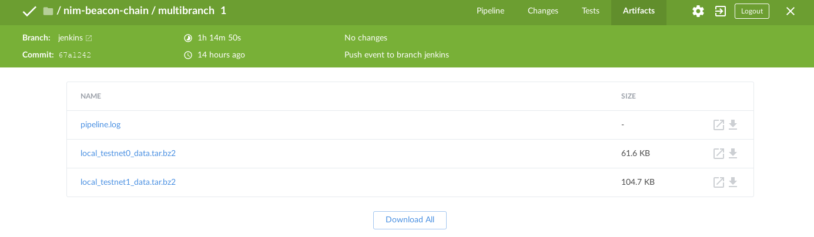

# Nimbus Eth2 (Beacon Chain)

[](https://github.com/status-im/nimbus-eth2/actions/workflows/ci.yml?query=branch%3Astable)
[](https://opensource.org/licenses/Apache-2.0)
[](https://opensource.org/licenses/MIT)

[](https://discord.gg/XRxWahP)
[](https://join.status.im/nimbus-general)
[](https://www.gitpoap.io/gh/status-im/nimbus-eth2)

Nimbus-eth2 is an extremely efficient consensus layer (eth2) client implementation. While it's optimised for embedded systems and resource-restricted devices -- including Raspberry Pis, its low resource usage also makes it an excellent choice for any server or desktop (where it simply takes up fewer resources).

<!-- START doctoc generated TOC please keep comment here to allow auto update -->
<!-- DON'T EDIT THIS SECTION, INSTEAD RE-RUN doctoc TO UPDATE -->

- [Documentation](#documentation)
- [Related projects](#related-projects)
- [Donations](#donations)
- [Branch guide](#branch-guide)
- [Developer resources](#developer-resources)
- [Tooling and utilities](#tooling-and-utilities)
- [For researchers](#for-researchers)
  - [State transition simulation](#state-transition-simulation)
  - [Local network simulation](#local-network-simulation)
  - [Visualising simulation metrics](#visualising-simulation-metrics)
  - [CI setup](#ci-setup)
- [License](#license)

<!-- END doctoc generated TOC please keep comment here to allow auto update -->

## Documentation

You can find the information you need to run a beacon node and operate as a validator in [The Book](https://nimbus.guide/).

The [Quickstart](https://nimbus.guide/quick-start.html) in particular will help you quickly connect to either mainnet or the Prater testnet.

## Quickly test your tooling against Nimbus

 The [Nimbus REST api](https://nimbus.guide/rest-api.html) is now available from:

* http://testing.mainnet.beacon-api.nimbus.team/
* http://unstable.mainnet.beacon-api.nimbus.team/
* http://unstable.prater.beacon-api.nimbus.team/

Note that right now these are very much unstable testing instances. They may be unresponsive at times - so **please do not rely on them for validating**. We may also disable them at any time.

## Migrate from another client

This [guide](https://nimbus.guide/migration.html) will take you through the basics of how to migrate to Nimbus from another client. See [here](https://nimbus.guide/migration-options.html) for advanced options.


## Related projects

* [status-im/nimbus-eth1](https://github.com/status-im/nimbus-eth1/): Nimbus for Ethereum 1
* [ethereum/consensus-specs](https://github.com/ethereum/consensus-specs/tree/v1.2.0-rc.1#phase-0): Consensus specification that this project implements

You can check where the beacon chain fits in the Ethereum ecosystem in our Two-Point-Oh series: https://our.status.im/tag/two-point-oh/

## Donations

If you'd like to contribute to Nimbus development, our donation address is [`0x70E47C843E0F6ab0991A3189c28F2957eb6d3842`](https://etherscan.io/address/0x70E47C843E0F6ab0991A3189c28F2957eb6d3842)

## Branch guide

* `stable` - latest stable release - **this branch is recommended for most users**
* `testing` - pre-release branch with features and bugfixes slated for the next stable release - this branch is suitable for use on testnets and for adventurous users that want to live on the edge.
* `unstable` - main development branch against which PR's are merged - if you want to contribute to Nimbus, start here.

## Developer resources

To build tools that interact with Nimbus while it's running, we expose an [RPC API](https://nimbus.guide/api.html).

To get started with developing Nimbus itself, see the [developer handbook](https://nimbus.guide/developers.html). The code follows the [Status Nim Style Guide](https://status-im.github.io/nim-style-guide/).

Nimbus is built in the [Nim language](https://nim-lang.org) - the compiler is automatically installed when building the project for the first time. More information - in particular security-related information about the language - can be found in the [Auditor Handbook](https://nimbus.guide/auditors-book/).

## Tooling and utilities

We provide several tools to interact with ETH2 and the data in the beacon chain:

* [ncli](ncli/ncli.nim) - command line tool with pretty printers, SSZ decoders, state transition helpers to interact with Eth2 data structures and functions
* [ncli_db](ncli/ncli_db.nim) - command line tool to perform surgery on the Nimbus sqlite database
* [multinet](https://github.com/status-im/nimbus-eth2/tree/master/multinet) - a set of scripts to build and run several Eth2 clients locally

## For researchers

### State transition simulation

The state transition simulator can quickly run the Beacon chain state transition function in isolation and output JSON snapshots of the state. The simulation runs without networking and blocks are processed without slot time delays.

```bash
# build and run the state simulator, then display its help ("-d:release" speeds it
# up substantially, allowing the simulation of longer runs in reasonable time)
make NIMFLAGS="-d:release" state_sim
build/state_sim --help
```

### Local network simulation

The local network simulation will create a full peer-to-peer network of beacon nodes and validators on a single machine, and run the beacon chain in real time.

Parameters such as shard, validator counts, and data folders are configured [vars.sh](tests/simulation/vars.sh). They can be set in as environment variables before launching the simulation.

```bash
# Clear data files from your last run and start the simulation with a new genesis block:
make VALIDATORS=192 NODES=6 USER_NODES=1 eth2_network_simulation

# In another terminal, get a shell with the right environment variables set:
./env.sh bash

# In the above example, the network is prepared for 7 beacon nodes but one of
# them is not started by default (`USER_NODES`) - this is useful to test
# catching up to the consensus. The following command will start the missing node.
./tests/simulation/run_node.sh 0 # (or the index (0-based) of the missing node)

# Running a separate node allows you to test sync as well as see what the action
# looks like from a single nodes' perspective.
```

By default, validators will be split in half between beacon node and validator
client processes (50/50), communicating through the
[common validator API](https://ethereum.github.io/consensus-APIs/#/ValidatorRequiredApi)
(for example with `192` validators and `6` nodes you will roughly end up with 6
beacon node and 6 validator client processes, where each of them will handle 16
validators), but if you don't want to use external validator clients and instead
want to have all the validators handled by the beacon nodes you may use
`BN_VC_VALIDATOR_SPLIT=no` as an additional argument to `make eth2_network_simulation`.

By default, the simulation will start from a pre-generated genesis state. If you wish to
simulate the bootstrap process with a Ethereum 1.0 validator deposit contract, start the
simulation with `WAIT_GENESIS=yes`

```
make eth2_network_simulation WAIT_GENESIS=yes
```

You can also separate the output from each beacon node in its own panel, using [multitail](https://www.vanheusden.com/multitail/):

```bash
make eth2_network_simulation USE_MULTITAIL="yes"
```

You can find out more about it in the [development update](https://our.status.im/nimbus-development-update-2018-12-2/).

_Alternatively, fire up our [experimental Vagrant instance with Nim pre-installed](https://our.status.im/setting-up-a-local-vagrant-environment-for-nim-development/) and give us your feedback about the process!_

### Visualising simulation metrics

The [generic instructions from the Nimbus repo](https://github.com/status-im/nimbus/#metric-visualisation) apply here as well.

Specific steps:

```bash
# This will generate the Prometheus config on the fly, based on the number of
# nodes (which you can control by passing something like NODES=6 to `make`).
make VALIDATORS=192 NODES=6 USER_NODES=0 eth2_network_simulation

# In another terminal tab, after the sim started:
cd tests/simulation/prometheus
prometheus
```

The dashboard you need to import in Grafana is "grafana/beacon\_nodes\_Grafana\_dashboard.json".


### CI setup

Local testnets run for 4 epochs each, to test finalization. That happens only on Jenkins Linux hosts, and their logs are available for download as artifacts, from the job's page. Don't expect these artifacts to be kept more than a day after the corresponding branch is deleted.



## License

Licensed and distributed under either of

* MIT license: [LICENSE-MIT](LICENSE-MIT) or https://opensource.org/licenses/MIT

or

* Apache License, Version 2.0: [LICENSE-APACHEv2](LICENSE-APACHEv2) or https://www.apache.org/licenses/LICENSE-2.0

at your option. These files may not be copied, modified, or distributed except according to those terms.
