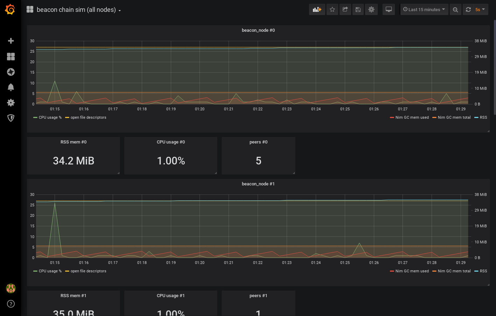

# Nimbus Eth2 (Beacon Chain)
[")](https://travis-ci.org/status-im/nim-beacon-chain)
[](https://dev.azure.com/nimbus-dev/nim-beacon-chain/_build/latest?definitionId=3&branchName=master)
[](https://opensource.org/licenses/Apache-2.0)
[](https://opensource.org/licenses/MIT)


[](https://discord.gg/XRxWahP)
[](https://gitter.im/status-im/nimbus)
[](https://join.status.im/nimbus-general)

Welcome to Nimbus for Ethereum 2.0.

Nimbus beacon chain is a research implementation of the beacon chain component of the upcoming Ethereum Serenity upgrade, aka Eth2.

## Related

* [status-im/nimbus](https://github.com/status-im/nimbus/): Nimbus for Ethereum 1
* [ethereum/eth2.0-specs](https://github.com/ethereum/eth2.0-specs/tree/v0.11.2#phase-0): Serenity specification that this project implements

You can check where the beacon chain fits in the Ethereum ecosystem our Two-Point-Oh series: https://our.status.im/tag/two-point-oh/

## Table of Contents

- [Nimbus Eth2 (Beacon Chain)](#nimbus-eth2-beacon-chain)
  - [Related](#related)
  - [Table of Contents](#table-of-contents)
  - [Prerequisites for everyone](#prerequisites-for-everyone)
    - [Linux](#linux)
    - [MacOS](#macos)
    - [Windows](#windows)
  - [For users](#for-users)
    - [Connecting to testnets](#connecting-to-testnets)
  - [Interop (for other Eth2 clients)](#interop-for-other-eth2-clients)
  - [For researchers](#for-researchers)
    - [State transition simulation](#state-transition-simulation)
    - [Local network simulation](#local-network-simulation)
    - [Visualising simulation metrics](#visualising-simulation-metrics)
    - [Network inspection](#network-inspection)
  - [For developers](#for-developers)
    - [Windows dev environment](#windows-dev-environment)
    - [Linux, MacOS](#linux-macos)
    - [Raspberry Pi](#raspberry-pi)
    - [Makefile tips and tricks for developers](#makefile-tips-and-tricks-for-developers)
  - [License](#license)

## Prerequisites for everyone

At the moment, Nimbus has to be built from source.

Nimbus has the following external dependencies:

* Developer tools (C compiler, Make, Bash, Git)
* PCRE

Nim is not an external dependency, Nimbus will build its own local copy.

### Linux

On common Linux distributions the dependencies can be installed with:
```sh
# Debian and Ubuntu
sudo apt-get install build-essential git libpcre3-dev

# Fedora
dnf install @development-tools pcre

# Archlinux, using an AUR manager for pcre-static
yourAURmanager -S base-devel pcre-static
```

### MacOS

Assuming you use [Homebrew](https://brew.sh/) to manage packages:

```sh
brew install pcre
```

Make sure you have [CMake](https://cmake.org/) installed, to be able to build libunwind (used for [lightweight stack traces](https://github.com/status-im/nim-libbacktrace)).

### Windows

You can install the developer tools by following the instruction in our [Windows dev environment section](#windows-dev-environment).
It also provides a downloading script for prebuilt PCRE.

### Android

* Install the [Termux](https://termux.com) app from FDroid or the Google Play store
* Install a [PRoot](https://wiki.termux.com/wiki/PRoot) of your choice following the instructions for your preferred distribution.
Note, the Ubuntu PRoot is known to contain all Nimbus prerequisites compiled on Arm64 architecture (common architecture for Android devices).

*Assuming Ubuntu PRoot is used*

```sh
apt install build-essential git libpcre3-dev
```

## For users

### Connecting to testnets

Nimbus connects to any of the testnets published in the [eth2-clients/eth2-testnets repo](https://github.com/eth2-clients/eth2-testnets/tree/master/nimbus).

Once the [prerequisites](#prerequisites) are installed you can connect to testnet0 with the following commands:

```bash
git clone https://github.com/status-im/nim-beacon-chain
cd nim-beacon-chain
make testnet0        # This will build Nimbus and all other dependencies
                     # and connect you to testnet0
```

The testnets are restarted once per week, usually on Monday evenings (UTC)) and integrate the changes for the past week.

## Interop (for other Eth2 clients)

After installing the [prerequisites](#prerequisites)

To run the Nimbus state transition, we provide the `ncli` tool:

* [ncli](ncli)

The interop scripts have been moved in a common repo, the interop relied on 0.8.3 specs which had seen significant changes. The interop branch still exist but is unmaintained.

* [multinet](https://github.com/status-im/nim-beacon-chain/tree/master/multinet) - a set of scripts to build and run several Eth2 clients locally
* [interop branch](https://github.com/status-im/nim-beacon-chain/tree/interop) (unmaintained)

## For researchers

### State transition simulation

The state transition simulator can quickly run the Beacon chain state transition function in isolation and output JSON snapshots of the state. The simulation runs without networking and blocks are processed without slot time delays.

```bash
# build and run the state simulator, then display its help ("-d:release" speeds it
# up substantially, allowing the simulation of longer runs in reasonable time)
make NIMFLAGS="-d:release" state_sim
build/state_sim --help
```

### Local network simulation

The local network simulation will create a full peer-to-peer network of beacon nodes and validators on a single machine, and run the beacon chain in real time.

Parameters such as shard, validator counts, and data folders are configured [vars.sh](tests/simulation/vars.sh). They can be set in as environment variables before launching the simulation.

```bash
# Clear data files from your last run and start the simulation with a new genesis block:
make VALIDATORS=192 NODES=6 USER_NODES=1 eth2_network_simulation

# In another terminal, get a shell with the right environment variables set:
./env.sh bash

# In the above example, the network is prepared for 7 beacon nodes but one of
# them is not started by default (`USER_NODES`) - this is useful to test
# catching up to the consensus. The following command will start the missing node.
./tests/simulation/run_node.sh 0 # (or the index (0-based) of the missing node)

# Running a separate node allows you to test sync as well as see what the action
# looks like from a single nodes' perspective.
```

You can also separate the output from each beacon node in its own panel, using [multitail](http://www.vanheusden.com/multitail/):

```bash
make USE_MULTITAIL="yes" eth2_network_simulation
```

You can find out more about it in the [development update](https://our.status.im/nimbus-development-update-2018-12-2/).

_Alternatively, fire up our [experimental Vagrant instance with Nim pre-installed](https://our.status.im/setting-up-a-local-vagrant-environment-for-nim-development/) and give us yout feedback about the process!_

### Visualising simulation metrics

The [generic instructions from the Nimbus repo](https://github.com/status-im/nimbus/#metric-visualisation) apply here as well.

Specific steps:

```bash
# This will generate the Prometheus config and the Grafana dashboard on the fly,
# based on the number of nodes (which you can control by passing something like NODES=6 to `make`).
# The `-d:insecure` flag starts an HTTP server from which the Prometheus daemon will pull the metrics.
make VALIDATORS=192 NODES=6 USER_NODES=0 NIMFLAGS="-d:insecure" eth2_network_simulation

# In another terminal tab, after the sim started:
cd tests/simulation/prometheus
prometheus
```

The dashboard you need to import in Grafana is "tests/simulation/beacon-chain-sim-all-nodes-Grafana-dashboard.json".



### Network inspection

The [inspector tool](./beacon_chain/inspector.nim) can help monitor the libp2p network and the various channels where blocks and attestations are being transmitted, showing message and connectivity metadata. By default, it will monitor all ethereum 2 gossip traffic.

```bash
. ./env.sh
# Build inspector for minimal config:
./env.sh nim c -d:const_preset=minimal -o:build/inspector_minimal beacon_chain/inspector.nim

# Build inspector for mainnet config:
./env.sh nim c -d:const_preset=mainnet -o:build/inspector_mainnet beacon_chain/inspector.nim

# See available options
./env.sh build/inspector_minimal --help

# Connect to a network from eth2 testnet repo bootstrap file - --decode option attempts to decode the messages as well
./env.sh build/inspector_minimal --decode -b:$(curl -s https://raw.githubusercontent.com/eth2-clients/eth2-testnets/master/nimbus/testnet0/bootstrap_nodes.txt | head -n1)
```

## For developers

Latest updates happen in the `devel` branch which is merged into `master` every week on Tuesday before deploying a new testnets
The following sections explain how to setup your build environment on your platform.

### Windows dev environment

Install Mingw-w64 for your architecture using the "[MinGW-W64 Online
Installer](https://sourceforge.net/projects/mingw-w64/files/)" (first link
under the directory listing). Run it and select your architecture in the setup
menu ("i686" on 32-bit, "x86\_64" on 64-bit), set the threads to "win32" and
the exceptions to "dwarf" on 32-bit and "seh" on 64-bit. Change the
installation directory to "C:\mingw-w64" and add it to your system PATH in "My
Computer"/"This PC" -> Properties -> Advanced system settings -> Environment
Variables -> Path -> Edit -> New -> C:\mingw-w64\mingw64\bin (it's "C:\mingw-w64\mingw32\bin" on 32-bit)

Install [Git for Windows](https://gitforwindows.org/) and use a "Git Bash" shell to clone and build nim-beacon-chain.

Install [CMake](https://cmake.org/) to be able to build libunwind (used for [lightweight stack traces](https://github.com/status-im/nim-libbacktrace)).

When running the tests, you might hit some Windows path length limits. Increase them by editing the Registry in a PowerShell instance with administrator privileges:

```powershell
Set-ItemProperty -Path 'HKLM:\SYSTEM\CurrentControlSet\Control\FileSystem' -Name 'LongPathsEnabled' -Value 1
```

and run this in a "Git Bash" terminal:

```bash
git config --global core.longpaths true
```

If you don't want to compile PCRE separately, you can fetch pre-compiled DLLs with:
```bash
mingw32-make fetch-dlls # this will place the right DLLs for your architecture in the "build/" directory
```

> If you were following the Windows testnet instructions, you can jump back to [Connecting to testnets](#connecting-to-testnets) now

You can now follow those instructions in the previous section by replacing `make` with `mingw32-make` (regardless of your 32-bit or 64-bit architecture):

```bash
mingw32-make test # run the test suite
```

### Linux, MacOS

After cloning the repo:

```bash
# The first `make` invocation will update all Git submodules.
# You'll run `make update` after each `git pull`, in the future, to keep those submodules up to date.
make

# Run tests
make test

# Update to latest version
git pull
make update
```

To run a command that might use binaries from the Status Nim fork:
```bash
./env.sh bash # start a new interactive shell with the right env vars set
which nim
nim --version # Nimbus is tested and supported on 1.0.2 at the moment

# or without starting a new interactive shell:
./env.sh which nim
./env.sh nim --version
```

### Raspberry Pi

We recommend you remove any cover or use a fan; the Raspberry Pi will get hot (85°C) and throttle.

* Raspberry PI 3b+ or Raspberry Pi 4b.
* 64gb SD Card (less might work too, but the default recommended 4-8GB will probably be too small)
* [Rasbian Buster Lite](https://www.raspberrypi.org/downloads/raspbian/) - Lite version is enough to get going and will save some disk space!

Assuming you're working with a freshly written image:

```bash

# Start by increasing swap size to 2gb:
sudo vi /etc/dphys-swapfile
# Set CONF_SWAPSIZE=2048
# :wq
sudo reboot

# Install prerequisites
sudo apt-get install git libgflags-dev libsnappy-dev libpcre3-dev

# Then you can follow instructions for Linux.

```

### Makefile tips and tricks for developers

- build all those tools known to the Makefile:

```bash
# $(nproc) corresponds to the number of cores you have
make -j$(nproc)
```

- build a specific tool:

```bash
make state_sim
```

- you can control the Makefile's verbosity with the V variable (defaults to 0):

```bash
make V=1 # verbose
make V=2 test # even more verbose
```

- same for the [Chronicles log level](https://github.com/status-im/nim-chronicles#chronicles_log_level):

```bash
make LOG_LEVEL=DEBUG bench_bls_sig_agggregation # this is the default
make LOG_LEVEL=TRACE beacon_node # log everything
```

- pass arbitrary parameters to the Nim compiler:

```bash
make NIMFLAGS="-d:release"
```

- you can freely combine those variables on the `make` command line:

```bash
make -j$(nproc) NIMFLAGS="-d:release" USE_MULTITAIL=yes eth2_network_simulation
```

- don't use the [lightweight stack tracing implementation from nim-libbacktrace](https://github.com/status-im/nim-beacon-chain/pull/745):

```bash
make USE_LIBBACKTRACE=0 # expect the resulting binaries to be 2-3 times slower
```

- publish a book using [mdBook](https://github.com/rust-lang/mdBook) from sources in "docs/" to GitHub pages:

```bash
make publish-book
```

## License

Licensed and distributed under either of

* MIT license: [LICENSE-MIT](LICENSE-MIT) or http://opensource.org/licenses/MIT

or

* Apache License, Version 2.0, ([LICENSE-APACHEv2](LICENSE-APACHEv2) or http://www.apache.org/licenses/LICENSE-2.0)

at your option. These files may not be copied, modified, or distributed except according to those terms.
