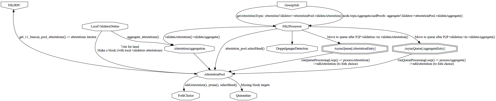

# Attestation Flow

This is a WIP document to explain the attestation flows.

## Validation & Verification flow

It is important to distinguish attestation `validation` from attestation `verification`.
- Attestation `validation` is defined in the P2P specs. Validated attestations can be forwarded on GossipSub.
  - Aggregated: https://github.com/ethereum/consensus-specs/blob/v1.4.0-alpha.1/specs/phase0/p2p-interface.md#beacon_aggregate_and_proof
  - Unaggregated: https://github.com/ethereum/consensus-specs/blob/v1.4.0-beta.5/specs/phase0/p2p-interface.md#beacon_attestation_subnet_id
- Attestation `verification` is defined in the consensus specs. Verified attestations can affect fork choice and may be included in a block.
  - https://github.com/ethereum/consensus-specs/blob/v1.4.0-beta.5/specs/phase0/beacon-chain.md#attestations

From the specs it seems like gossip attestation `validation` is a superset of consensus attestation `verification`.

### Inputs

Attestations can be received from the following sources:
- GossipSub
  - Aggregated: `/eth2/{$forkDigest}/beacon_aggregate_and_proof/ssz_snappy`
  - Unaggregated: `/eth2/{$forkDigest}/beacon_attestation_{subnetIndex}/ssz_snappy`
- within received blocks
- the NBC database (within a block)
- a local validator vote
- dev tools: test suite, ncli, fuzzing

The related base types are
- `Attestation`
- `IndexedAttestation`

The base types are defined in the Eth2 specs. On top of these, Nimbus adds further types to represent the level of trust and validation / verification of attestations with regards to each BeaconBlock. Those additional types allow the Nim compiler to help ensuring proper usage at compile time without introducing runtime cost.

#### TrustedAttestation & TrustedIndexedAttestation

An `Attestation` or `IndexedAttestation` that was successfully verified as per the consensus spec, or that was retrieved from a trusted source of blocks, e.g., the database, is considered trusted. The signature is assumed to have been already verified.

_TODO Note: As gossip attestation validation seems to be a superset of consensus attestation verification we might use `TrustedAttestation` earlier in the attestation flow._

## Attestation processing architecture

This diagram visualizes how the various modules interact with a block:

_TODO Note: Image is outdated, attestation queues were removed from the Eth2Processor._

### Inbound gossip flow

These GossipSub topics are used to listen for attestations:
- Aggregated: `/eth2/{$forkDigest}/beacon_aggregate_and_proof/ssz_snappy`
- Unaggregated: `/eth2/{$forkDigest}/beacon_attestation_{subnetIndex}/ssz_snappy`

The attestations are then validated by `validateAttestation()` or `validateAggregate()` in either `attestationValidator()` or `aggregateValidator()` according to the P2P specs.
- https://github.com/ethereum/consensus-specs/blob/v1.4.0-beta.5/specs/phase0/p2p-interface.md#beacon_aggregate_and_proof
- https://github.com/ethereum/consensus-specs/blob/v1.4.0-beta.5/specs/phase0/p2p-interface.md#attestation-subnets

Finally, valid attestations are added to the local `attestationPool`.
Attestations are dropped in case of an error.

### Outbound gossip flow

After validation in `attestationValidator()` or `aggregateValidator()` in eth2_processor
- We jump into method `validate(PubSub, Message)` in libp2p/protocols/pubsub/pubsub.nim
- which was called by `rpcHandler(GossipSub, PubSubPeer, RPCMsg)`

### Consensus RPC in

There is no RPC for attestations but attestations might be included in synced blocks.
### Comments

### Sync vs Steady State

During sync the only attestations we receive are included in synced blocks.
Afterwards attestations come from GossipSub.

#### Bottlenecks during sync

Verifying attestations only consumes a small share of block processing time. Attestation processing is not a bottleneck during sync.

##### Latency & Throughput sensitiveness

We distinguish aggregation of attestations from batched validation:
- aggregation of attestations is defined by the consensus specs. When multiple validators sign the same attestation, their individual signatures may be combined into an aggregate signature to save storage space and to reduce validation time. The aggregate signature is exchanged over the P2P network and included in blocks, but the aggregate public key is computed on-the-fly based on the individual validator public keys according to a participation bitfield.
- batched validation is an opportunistic client side optimization. Multiple attestations of the same underlying data are collected and processed as a batch once a threshold of them has been received or after a time limit is exceeded. As part of this batched validation, both the aggregate signature as well as the aggregate public key are computed on-the-fly.

Attestations are included in blocks during sync and do not require gossip validation.
They are also aggregated per validator and can be batched with other signatures within a block.

After sync, attestations need to be rebroadcasted quickly to:
- maintain the quality of the GossipSub mesh
- not be booted by peers

Attestations need to be validated or aggregated quickly to avoid delaying other networking operations. Their computation is bottlenecked by cryptographic operations.

The number of attestations to process grows with the number of peers. An aggregated attestation is as cheap to process as an unaggregated one. Batching is worth it even with only 2 attestations to batch.
