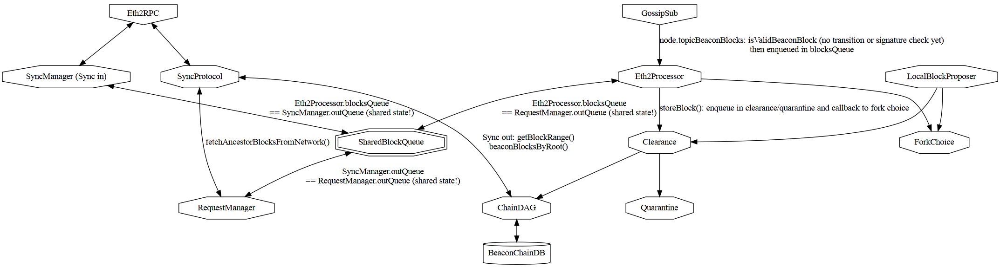

# Beacon Block Flow

This is a WIP document to explain the beacon block flows.

## Validation & Verification flow

Important distinction:
- We distinguish block `validation` which is defined in the P2P specs:
  https://github.com/ethereum/consensus-specs/blob/v1.4.0-beta.5/specs/phase0/p2p-interface.md#beacon_block.
  A validated block can be forwarded on gossipsub.
- and we distinguish `verification` which is defined in consensus specs:
  https://github.com/ethereum/consensus-specs/blob/v1.4.0-beta.5/specs/phase0/beacon-chain.md#block-processing
  A block needs to be verified to enter fork choice, the DAG and the BeaconChainDB

In particular in terms of costly checks validating a block only requires checking:
- the **block proposer signature**

while verifying a block requires checking:
- the state transition
- the block proposer signature
- and also the signatures within a block:
  - Randao Reveal
  - Proposer slashings
  - Attester slashings
  - Attestations
  - VoluntaryExits

### Inputs

Blocks can be received from the following sources:
- Gossipsub
  - via `topicBeaconBlocks` (`&"/eth2/{$forkDigest}/{topicBeaconBlocksSuffix}"`). They are then validated by `blockValidator` (in `eth2_processor.nim`) which calls `validateBeaconBlock`
- ETH2 RPC
  - via SyncManager (when Nimbus syncs)
  - via RequestManager (when Nimbus needs ancestor blocks)
- the NBC database
- a local validator block proposal
- Devtools: test suite, ncli, fuzzing

The related base types are:
- BeaconBlockBody
- BeaconBlock
  - BeaconBlockBody
  - + metadata (slot, blockchain state before/after, proposer)
- BeaconBlockHeader
  - metadata (slot, blockchain state before/after, proposer)
  - Merkle hash of the BeaconBlockBody
- SignedBeaconBlock
  - BeaconBlock
  - + BLS signature

The base types are defined in the Eth2 specs.
On top, Nimbus builds new types to represent the level of trust and validation we have with regards to each BeaconBlock.
Those types allow the Nim compiler to help us ensure proper usage at compile-time and zero runtime cost.

#### BeaconBlocks

Those are spec-defined types.

On deserialization the SSZ code guarantees that BeaconBlock are correctly max-sized
according to:
- MAX_PROPOSER_SLASHINGS
- MAX_ATTESTER_SLASHINGS
- MAX_ATTESTATIONS
- MAX_DEPOSITS
- MAX_VOLUNTARY_EXITS

#### TrustedBeaconBlocks

A block that has been fully checked to be sound
both in regards to the blockchain protocol and its cryptographic signatures is known as a `TrustedBeaconBlock` or `TrustedSignedBeaconBlock`.
This allows skipping expensive signature checks.
Blocks are considered trusted if they come from:
- the NBC database
- produced by a local validator

#### SigVerifiedBeaconBlocks

A block with a valid cryptographic signature is considered SigVerified.
This is a weaker guarantee than Trusted as the block might still be invalid according to the state transition function.
Such a block are produced if incoming gossip blocks' signatures are batched together for batch verification **before** being passed to state transition.

#### TransitionVerifiedBeaconBlocks

A block that passes the state transition checks and can be successfully applied to the beacon chain is considered `TransitionVerified`.
Such a block can be produced if incoming blocks' signatures are batched together for batch verification **after** successfully passing state transition.

_This is not used in Nimbus at the moment_

## Block processing architecture

How the various modules interact with block is described in a diagram:

It is important to note that 3 data structures are sharing the same `AsyncQueue[BlockEntry]`:
- Eth2Processor.blockQueue
- SyncManager.outQueue
- RequestManager.outQueue

### Gossip flow in

Blocks are listened to via the gossipsub topic `/eth2/{$forkDigest}/beacon_block/ssz_snappy` (`topicBeaconBlocks` variable)

They are then:
- validated by `blockValidator()` in the Eth2Processor by `validateBeaconBlock()` according to spec https://github.com/ethereum/consensus-specs/blob/v1.4.0-beta.4/specs/phase0/p2p-interface.md#beacon_block
- Important: P2P validation is not full verification (state transition and internal cryptographic signatures were not checked)
- enqueued in the shared block queue `AsyncQueue[BlockEntry]` in case of success
- dropped in case of error

Logs:
- debug: "Dropping already-seen gossip block"
- debug: "Block received"
- trace: "Block validated"

### Gossip flow out

- After validation in `blockValidator()` in the Eth2Processor by `validateBeaconBlock()` according to spec https://github.com/ethereum/consensus-specs/blob/v1.4.0-beta.5/specs/phase0/p2p-interface.md#beacon_block
- Important: P2P validation is not full verification (state transition and internal cryptographic signatures were not checked)
- We jump into libp2p/protocols/pubsub/pubsub.nim in the method `validate(PubSub, message)`
- which was called by `rpcHandler(GossipSub, PubSubPeer, RPCMsg)`

### Block syncing

See [Block syncing](../beacon_chain/sync/README.md)
for flow explanation and performance characteristics.

### Consuming the shared block queue

The SharedBlockQueue is consumed by the Eth2Processor via `runQueueProcessingLoop(Eth2Processor)`

To mitigate blocking networking and timeshare between Io and compute, blocks are processed 1 by 1 by `processBlock(Eth2Processor, BlockEntry)`

This in turn calls:
- `storeBlock(Eth2Processor, SignedBeaconBlock, Slot)`
- `addHeadBlock(ChainDAGRef, var BatchVerifier, SignedBeaconBlock, forkChoiceCallback)`
- trigger sending attestation if relevant

### Steady state (synced to head)
#### Bottlenecks when synced

The SyncManager is deactivated

RequestManager and Gossip are activated.

##### Backpressure

There is no backpressure handling at the RequestManager and Gossip level with regards to the SharedBlockQueue

There is backpressure handling at the Quarantine level:
- Blocks in the SharedBlockQueue that are missing parents
  are put in quarantine, only 16 can be stored and new candidate are dropped as long as the older ones are unresolved.

##### Latency & Throughput sensitiveness

When synced, blocks are a small part of the whole processing compared to attestations, there is no more throughput constraint however a single block should be processed ASAP as it blocks attestation flow.

Furthermore to ensure the stability of the gossip mesh, blocks should be validated and rebroadcasted ASAP as well.
