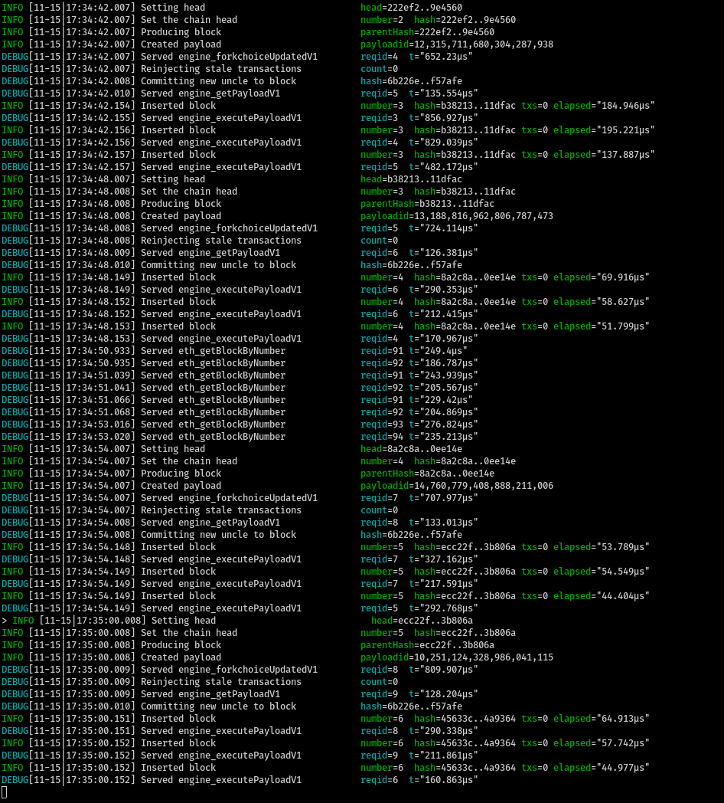

# How to run Catalyst

- Clone Geth: `git clone --branch kintsugi-spec https://github.com/MariusVanDerWijden/go-ethereum.git ~/execution_clients/go-ethereum
- Build Geth and Catalyst with `make geth`
- Run `scripts/run-catalyst.sh` to run Catalyst. It listens on port 8545.

# Verify Catalyst is working

- Clone Nimbus and check out the `kintsugi` branch
- Run `scripts/run-catalyst.sh`. This depends on the paths set up in the first section. If those are changed, adjust accordingly.
- While the Geth console is running, run `scripts/check_merge_test_vectors.sh`.

The results should be similar to
```
engine_forkchoiceUpdatedV1 response: {"jsonrpc":"2.0","id":67,"result":{"status":"SUCCESS","payloadId":"0xa247243752eb10b4"}}
engine_getPayloadV1 response: {"jsonrpc":"2.0","id":67,"result":{"parentHash":"0x3b8fb240d288781d4aac94d3fd16809ee413bc99294a085798a589dae51ddd4a","coinbase":"0xa94f5374fce5edbc8e2a8697c15331677e6ebf0b","stateRoot":"0xca3149fa9e37db08d1cd49c9061db1002ef1cd58db2210f2115c8c989b2bdf45","receiptRoot":"0x56e81f171bcc55a6ff8345e692c0f86e5b48e01b996cadc001622fb5e363b421","logsBloom":"0x00000000000000000000000000000000000000000000000000000000000000000000000000000000000000000000000000000000000000000000000000000000000000000000000000000000000000000000000000000000000000000000000000000000000000000000000000000000000000000000000000000000000000000000000000000000000000000000000000000000000000000000000000000000000000000000000000000000000000000000000000000000000000000000000000000000000000000000000000000000000000000000000000000000000000000000000000000000000000000000000000000000000000000000000000000000","random":"0x0000000000000000000000000000000000000000000000000000000000000000","blockNumber":"0x1","gasLimit":"0x1c9c380","gasUsed":"0x0","timestamp":"0x5","extraData":"0x","baseFeePerGas":"0x7","blockHash":"0x3559e851470f6e7bbed1db474980683e8c315bfce99b2a6ef47c057c04de7858","transactions":[]}}
engine_executePayloadV1 response: {"jsonrpc":"2.0","id":67,"result":{"status":"VALID","latestValidHash":"0x3559e851470f6e7bbed1db474980683e8c315bfce99b2a6ef47c057c04de7858"}}
engine_forkchoiceUpdatedV1 response: {"jsonrpc":"2.0","id":67,"result":{"status":"SUCCESS","payloadId":null}}
kintsugi test vectors passed
```

- If issues present themselves here, or when Nimbus attempts to use the API, one can `debug.verbosity(4)` console command in Catalyst.

# Verify that Nimbus runs through the same examples

- Ensure `tests/test_merge_vectors.nim` points to the correct Web3 URL, e.g.:
```
diff --git a/tests/test_merge_vectors.nim b/tests/test_merge_vectors.nim
index 7eedb46d..1a573c80 100644
--- a/tests/test_merge_vectors.nim
+++ b/tests/test_merge_vectors.nim
@@ -12,7 +12,7 @@ import

 suite "Merge test vectors":
   let web3Provider = (waitFor Web3DataProvider.new(
-    default(Eth1Address), "ws://127.0.0.1:8551")).get
+    default(Eth1Address), "ws://127.0.0.1:8546")).get

   test "getPayload, executePayload, and forkchoiceUpdated":
     const feeRecipient =
```

- Run `./env.sh nim c -r tests/test_merge_vectors.nim`. It should show output akin to:

```
[Suite] Merge test vectors
  [OK] getPayload, executePayload, and forkchoiceUpdated
```

# How to run Nimbus local testnet with Catalyst

- Check out branch `kintsugi`
- Run (and keep running) `./scripts/run-catalyst.sh`. It should look something like


- Run `./scripts/launch_local_testnet.sh --preset minimal --nodes 4 --disable-htop --stop-at-epoch 7 -- --verify-finalization --discv5:no`

This creates a 4-node local testnet with 128 validators.

The Nimbus console output will be similar to


Meanwhile, Nimbus is interacting with Geth/Catalyst in preparing, getting, and executing payloads:

