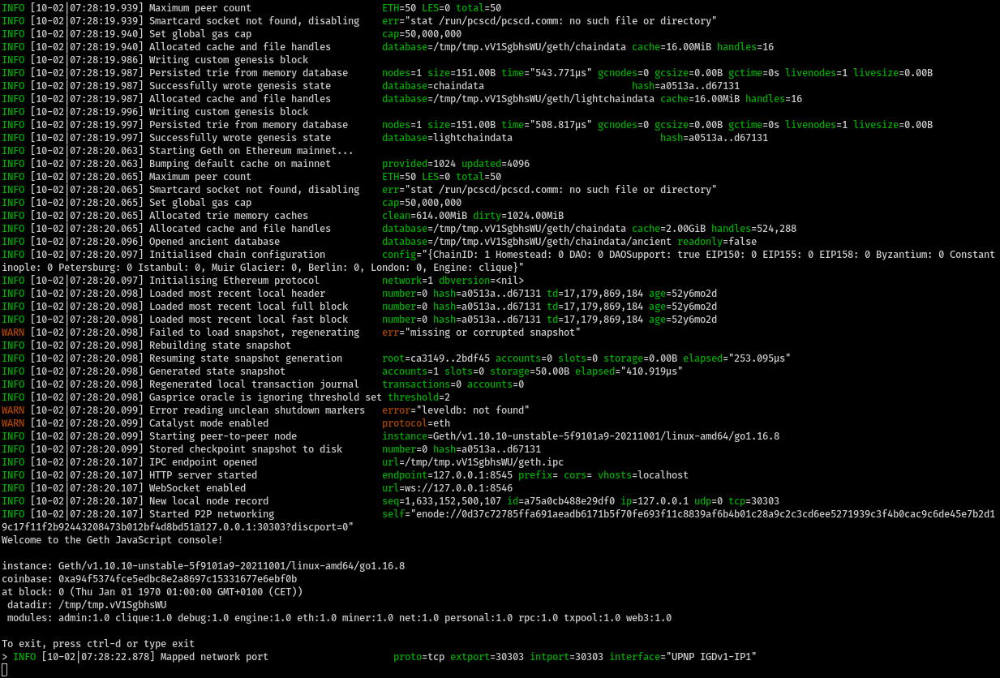
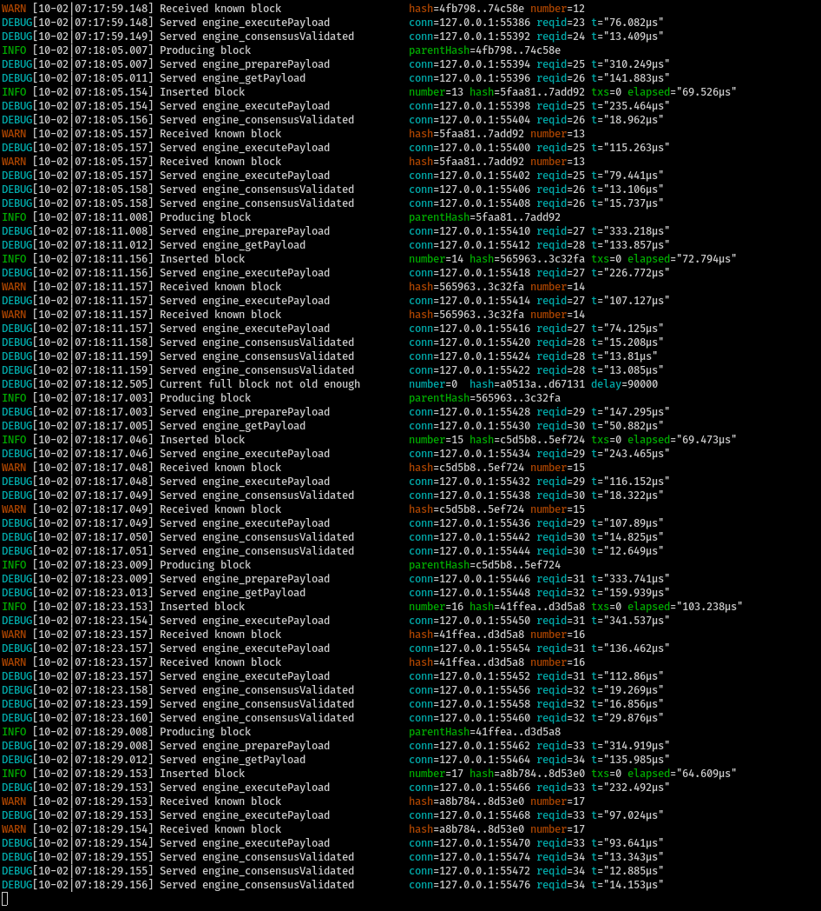

Nimbus passes phase 0, Altair, and Merge consensus spec tests in minimal and mainnet presets.

# How to run Besu

- Clone Besu: `git clone --branch merge-interop-spec https://github.com/hyperledger/besu.git ~/execution-clients/besu`
- Create genesis.json file from configuration specified in https://notes.ethereum.org/@9AeMAlpyQYaAAyuj47BzRw/rkwW3ceVY
- Follow instructions in https://github.com/hyperledger/besu/issues/2830

# Verify Catalyst is working

- Clone Nimbus recursively with submodules and check out the `amphora-merge-interop` branch
- Run `scripts/run-catalyst.sh`. This depends on the paths set up in the first section. If those are changed, adjust accordingly.
- While the Geth console is running, run `scripts/check_merge_test_vectors.sh`.

The results should be similar to
```
engine_preparePayload response: {"jsonrpc":"2.0","id":67,"result":"0x0"}
engine_getPayload response: {"jsonrpc":"2.0","id":67,"result":{"blockHash":"0x7a694c5e6e372e6f865b073c101c2fba01f899f16480eb13f7e333a3b7e015bc","parentHash":"0xa0513a503d5bd6e89a144c3268e5b7e9da9dbf63df125a360e3950a7d0d67131","coinbase":"0x0000000000000000000000000000000000000000","stateRoot":"0xca3149fa9e37db08d1cd49c9061db1002ef1cd58db2210f2115c8c989b2bdf45","receiptRoot":"0x56e81f171bcc55a6ff8345e692c0f86e5b48e01b996cadc001622fb5e363b421","logsBloom":"0x00000000000000000000000000000000000000000000000000000000000000000000000000000000000000000000000000000000000000000000000000000000000000000000000000000000000000000000000000000000000000000000000000000000000000000000000000000000000000000000000000000000000000000000000000000000000000000000000000000000000000000000000000000000000000000000000000000000000000000000000000000000000000000000000000000000000000000000000000000000000000000000000000000000000000000000000000000000000000000000000000000000000000000000000000000000","random":"0x0000000000000000000000000000000000000000000000000000000000000000","blockNumber":"0x1","gasLimit":"0x989680","gasUsed":"0x0","timestamp":"0x5","extraData":"0x","baseFeePerGas":"0x0","transactions":[]}}
Execution test vectors for Merge passed
```

- If issues present themselves here, or when Nimbus attempts to use the API, one can `debug.verbosity(4)` console command in Catalyst.

# Verify that Nimbus runs through the same examples

- Run `./env.sh nim c -r tests/test_merge_vectors.nim`. It should show output akin to:

```
[Suite] Merge test vectors
DBG 2021-10-01 14:56:56.127+00:00 Message sent to RPC server                 topics="JSONRPC-HTTP-CLIENT" tid=354460 file=httpclient.nim:191 address=127.0.0.1:8545 msg_len=308
DBG 2021-10-01 14:56:56.128+00:00 Message sent to RPC server                 topics="JSONRPC-HTTP-CLIENT" tid=354460 file=httpclient.nim:191 address=127.0.0.1:8545 msg_len=70
DBG 2021-10-01 14:56:56.128+00:00 Message sent to RPC server                 topics="JSONRPC-HTTP-CLIENT" tid=354460 file=httpclient.nim:191 address=127.0.0.1:8545 msg_len=1193
DBG 2021-10-01 14:56:56.129+00:00 Message sent to RPC server                 topics="JSONRPC-HTTP-CLIENT" tid=354460 file=httpclient.nim:191 address=127.0.0.1:8545 msg_len=172
  [OK] preparePayload, getPayload, executePayload, and consensusValidated
DBG 2021-10-01 14:56:56.129+00:00 Message sent to RPC server                 topics="JSONRPC-HTTP-CLIENT" tid=354460 file=httpclient.nim:191 address=127.0.0.1:8545 msg_len=74
{"code":5,"message":"unknown payload"}
  [OK] getPayload unknown payload
DBG 2021-10-01 14:56:56.129+00:00 Message sent to RPC server                 topics="JSONRPC-HTTP-CLIENT" tid=354460 file=httpclient.nim:191 address=127.0.0.1:8545 msg_len=172
  [OK] consensusValidated unknown header
```

# How to run Nimbus local testnet with Catalyst

- Check out branch `amphora-merge-interop`
- Run (and keep running) `./scripts/run-catalyst.sh`. It should look something like



- Run `./scripts/launch_local_testnet.sh --preset minimal --nodes 4 --disable-htop --stop-at-epoch 7 -- --verify-finalization --discv5:no`

This creates a 4-node local testnet with 128 validators.

The Nimbus console output will be similar to
```
NOT 2021-10-02 07:14:01.809+02:00 Generating deposits                        tid=695415 file=keystore_management.nim:441 totalNewValidators=128 validatorsDir=local_testnet_data/validators secretsDir=local_testnet_data/secrets
NOT 2021-10-02 07:14:41.840+02:00 Deposit data written                       tid=695415 file=deposit_contract.nim:222 filename=local_testnet_data/deposits.json
Wrote local_testnet_data/genesis.ssz
{"lvl":"WRN","ts":"2021-10-02 07:14:41.849+02:00","msg":"Using insecure password to lock networking key","tid":695608,"file":"keystore_management.nim:372","key_path":"local_testnet_data/network_key.json"}
{"lvl":"INF","ts":"2021-10-02 07:14:42.526+02:00","msg":"New network key storage was created","topics":"networking","tid":695608,"file":"eth2_network.nim:1763","key_path":"local_testnet_data/network_key.json","network_public_key":"0802122102cedeccf39e6a247b8911ccc01716befb1501546b3f7bc9c3c16dbea64de3b3f3"}
Wrote local_testnet_data/bootstrap_nodes.txt
Wrote local_testnet_data/config.yaml:
PRESET_BASE: minimal
MIN_GENESIS_ACTIVE_VALIDATOR_COUNT: 128
MIN_GENESIS_TIME: 0
GENESIS_DELAY: 10
DEPOSIT_CONTRACT_ADDRESS: 0x0000000000000000000000000000000000000000
ETH1_FOLLOW_DISTANCE: 1
ALTAIR_FORK_EPOCH: 1
MERGE_FORK_EPOCH: 2
```

Meanwhile, Nimbus is interacting with Geth/Catalyst in preparing, getting, executing, and marking as valid execution payloads:

