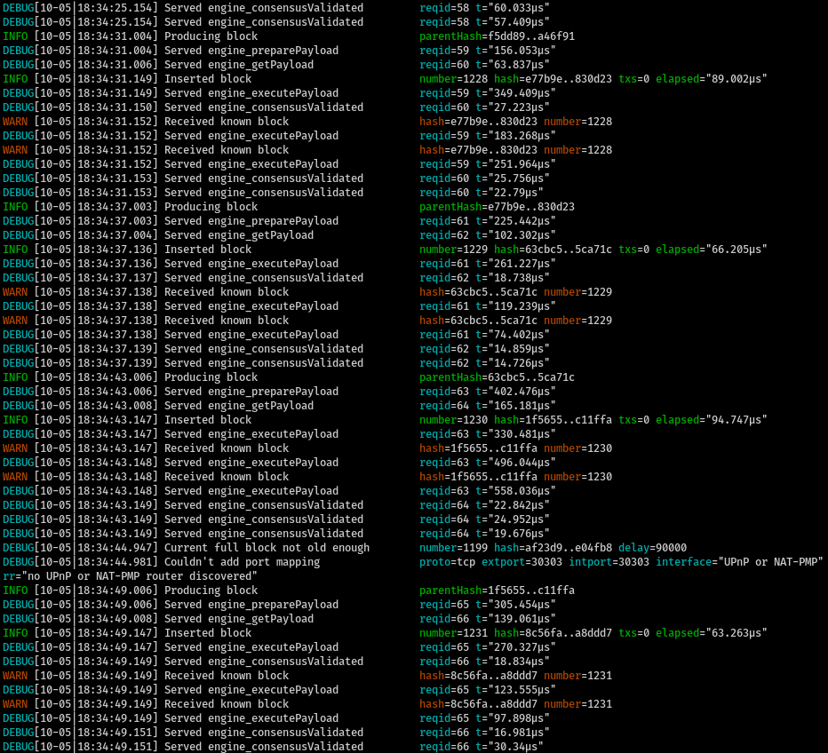

Nimbus passes phase 0, Altair, and Merge consensus spec tests in minimal and mainnet presets.

# How to run Geth

- Clone Geth: `git clone --branch merge-interop-spec https://github.com/MariusVanDerWijden/go-ethereum.git ~/execution-clients/go-ethereum`
- Build Geth and Geth with `make geth`
- Run `scripts/run-catalyst.sh` to run Geth. It listens on HTTP port 8545 and websockets port 8546.
- At the Geth console, run the `miner.start()` command.

# Verify that Nimbus runs through the merge vectors

- Wait for Geth to mine through to the total transition difficulty
- Run `./env.sh nim c -r tests/test_merge_vectors.nim`. It should show output akin to:

```
[Suite] Merge test vectors
  [OK] preparePayload, getPayload, executePayload, consensusValidated, and forkchoiceUpdated
{"code":5,"message":"unknown payload"}
  [OK] getPayload unknown payload
```

# How to run Nimbus local testnet with Geth

- Check out branch `amphora-merge-interop`
- Run (and keep running) `./scripts/run-catalyst.sh`.

- Run `./scripts/launch_local_testnet.sh --preset minimal --nodes 4 --disable-htop --stop-at-epoch 7 -- --verify-finalization --discv5:no`

This creates a 4 node local testnet with 128 validators.

The Nimbus console output will be similar to
```
Wrote local_testnet_data/genesis.ssz
Wrote local_testnet_data/bootstrap_nodes.txt
Wrote local_testnet_data/config.yaml:
PRESET_BASE: minimal
MIN_GENESIS_ACTIVE_VALIDATOR_COUNT: 128
MIN_GENESIS_TIME: 0
GENESIS_DELAY: 10
DEPOSIT_CONTRACT_ADDRESS: 0x0000000000000000000000000000000000000000
ETH1_FOLLOW_DISTANCE: 1
ALTAIR_FORK_EPOCH: 1
MERGE_FORK_EPOCH: 2
```

Meanwhile, Nimbus is interacting with Geth in preparing, getting, executing, and marking as valid execution payloads:

