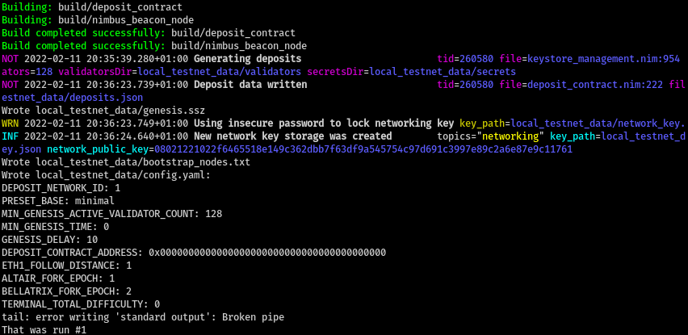
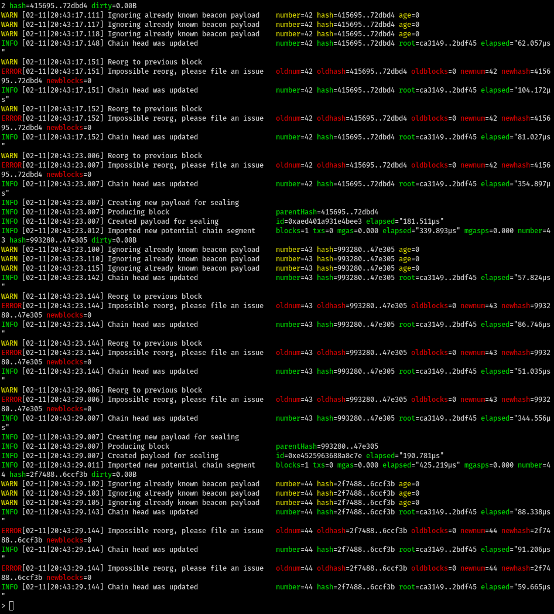

# How to run Geth

- Clone Geth: `git clone --branch merge-kiln https://github.com/MariusVanDerWijden/go-ethereum.git ~/execution_clients/go-ethereum
- Build Geth with `make geth`
- Run `scripts/run-catalyst.sh` to run Geth. It listens on port 8551.

# Verify Geth is working

- Clone Nimbus and check out the `kiln` branch
- Run `scripts/run-catalyst.sh`. This depends on the paths set up in the first section. If those are changed, adjust accordingly.
- While the Geth console is running, run `scripts/check_merge_test_vectors.sh`.

The results should be similar to
```
engine_forkchoiceUpdatedV1 response: {"jsonrpc":"2.0","id":67,"result":{"payloadStatus":{"status":"VALID","latestValidHash":null,"validationError":null},"payloadId":"0xa247243752eb10b4"}}
engine_getPayloadV1 response: {"jsonrpc":"2.0","id":67,"result":{"parentHash":"0x3b8fb240d288781d4aac94d3fd16809ee413bc99294a085798a589dae51ddd4a","feeRecipient":"0xa94f5374fce5edbc8e2a8697c15331677e6ebf0b","stateRoot":"0xca3149fa9e37db08d1cd49c9061db1002ef1cd58db2210f2115c8c989b2bdf45","receiptsRoot":"0x56e81f171bcc55a6ff8345e692c0f86e5b48e01b996cadc001622fb5e363b421","logsBloom":"0x00000000000000000000000000000000000000000000000000000000000000000000000000000000000000000000000000000000000000000000000000000000000000000000000000000000000000000000000000000000000000000000000000000000000000000000000000000000000000000000000000000000000000000000000000000000000000000000000000000000000000000000000000000000000000000000000000000000000000000000000000000000000000000000000000000000000000000000000000000000000000000000000000000000000000000000000000000000000000000000000000000000000000000000000000000000","random":"0x0000000000000000000000000000000000000000000000000000000000000000","blockNumber":"0x1","gasLimit":"0x1c95111","gasUsed":"0x0","timestamp":"0x5","extraData":"0x","baseFeePerGas":"0x7","blockHash":"0x6359b8381a370e2f54072a5784ddd78b6ed024991558c511d4452eb4f6ac898c","transactions":[]}}
engine_executePayloadV1 response: {"jsonrpc":"2.0","id":67,"result":{"status":"VALID","latestValidHash":"0x3559e851470f6e7bbed1db474980683e8c315bfce99b2a6ef47c057c04de7858","validationError":null}}
engine_forkchoiceUpdatedV1 response: {"jsonrpc":"2.0","id":67,"result":{"payloadStatus":{"status":"VALID","latestValidHash":null,"validationError":null},"payloadId":null}}
engine_getPayloadV1 error case response: {"jsonrpc":"2.0","id":67,"error":{"code":-32602,"message":"invalid argument 0: invalid payload id \"0x01\": hex string has length 2, want 16 for PayloadID"}}
engine_getPayloadV1 error case response: {"jsonrpc":"2.0","id":67,"error":{"code":-32001,"message":"Unknown payload"}}
engine_getPayloadV1 case response: {"jsonrpc":"2.0","id":67,"result":{"payloadStatus":{"status":"SYNCING","latestValidHash":null,"validationError":null},"payloadId":null}}
Kiln test vectors passed
```

- If issues present themselves here, or when Nimbus attempts to use the API, one can `debug.verbosity(4)` console command in Geth.

# Verify that Nimbus runs through the same examples

- Run `./env.sh nim c -r tests/test_merge_vectors.nim`. It should show output akin to:

```
[Suite] Merge test vectors
  [OK] getPayload, newPayload, and forkchoiceUpdated
```

# How to run Nimbus local testnet with Geth

- Check out branch `kiln`
- Run (and keep running) `./scripts/run-catalyst.sh`.
- Run `./scripts/launch_local_testnet.sh --preset minimal --nodes 4 --disable-htop --stop-at-epoch 7 -- --verify-finalization --discv5:no`

This creates a 4-node local testnet with 128 validators.

The Nimbus console output will be similar to

The broken pipe on `tail` is normal, and unrelated to merge aspects of Nimbus.

Meanwhile, Nimbus is interacting with Geth in preparing, getting, and executing payloads:

