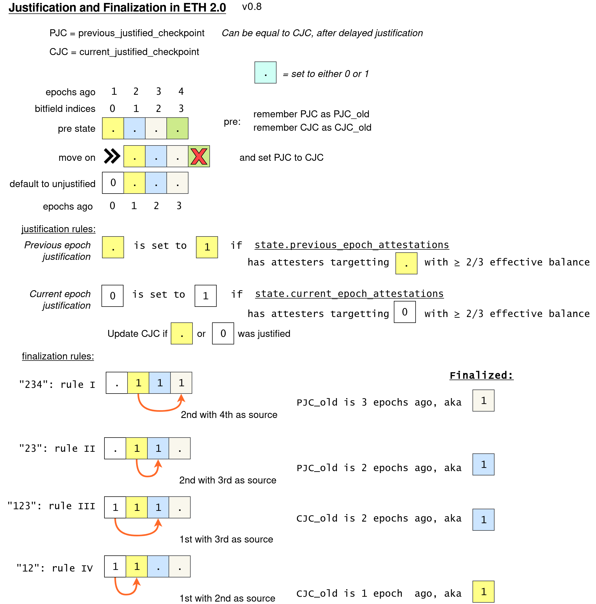

Spec: [https://github.com/ethereum/eth2.0-specs/blob/dev/specs/phase0/beacon-chain.md#justification-and-finalization](https://github.com/ethereum/eth2.0-specs/blob/dev/specs/phase0/beacon-chain.md#justification-and-finalization)

Visual depiction: [https://github.com/protolambda/eth2-docs#justification-and-finalization](https://github.com/protolambda/eth2-docs#justification-and-finalization)

Implementation: [https://github.com/status-im/nim-beacon-chain/blob/543cbdfc6b9bc16f0331df2797422b7dc4d61eeb/beacon_chain/spec/state_transition_epoch.nim#L102-L240](https://github.com/status-im/nim-beacon-chain/blob/543cbdfc6b9bc16f0331df2797422b7dc4d61eeb/beacon_chain/spec/state_transition_epoch.nim#L102-L240)

Self-test: [https://github.com/status-im/nim-beacon-chain/blob/master/tests/spec_epoch_processing/test_process_justification_and_finalization.nim](https://github.com/status-im/nim-beacon-chain/blob/master/tests/spec_epoch_processing/test_process_justification_and_finalization.nim)

EF test vectors: [https://github.com/status-im/nim-beacon-chain/blob/543cbdfc/tests/official/test_fixture_state_transition_epoch.nim#L57-L58](https://github.com/status-im/nim-beacon-chain/blob/543cbdfc6b9bc16f0331df2797422b7dc4d61eeb/tests/official/test_fixture_state_transition_epoch.nim#L57-L58)
