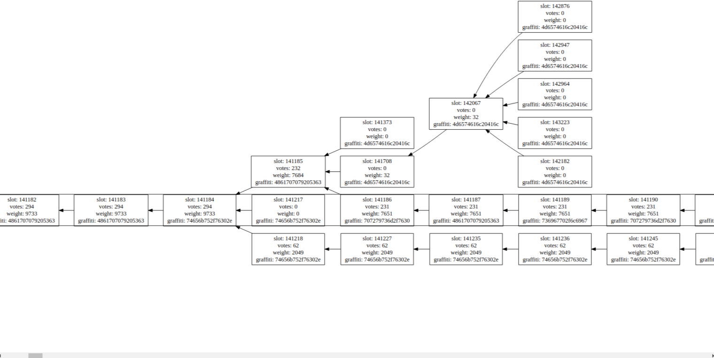

Spec: [https://github.com/ethereum/eth2.0-specs/blob/v0.12.2/specs/phase0/beacon-chain.md](https://github.com/ethereum/eth2.0-specs/blob/v0.12.2/specs/phase0/beacon-chain.md)
Code: [https://github.com/status-im/nim-beacon-chain/blob/bc6eefe3/beacon_chain/spec/state_transition_epoch.nim#L242-L440](https://github.com/status-im/nim-beacon-chain/blob/bc6eefe31ec60a7a1740b444e5c132fa55b4e859/beacon_chain/spec/state_transition_epoch.nim#L242-L440)

Test: Missing ! For a long-time rewards and penalties tests were missing and they have not been integrated in NBC [https://github.com/status-im/nim-beacon-chain/blame/bc6eefe3/tests/official/test_fixture_state_transition_epoch.nim#L60-L63](https://github.com/status-im/nim-beacon-chain/blame/bc6eefe31ec60a7a1740b444e5c132fa55b4e859/tests/official/test_fixture_state_transition_epoch.nim#L60-L63)

Fuzzing: Missing ! ([https://github.com/sigp/beacon-fuzz](https://github.com/sigp/beacon-fuzz))

Note: an unclear rewards/penalties spec led to non-finalization in the very first testnet Schlesi.

Improvement in the spec test suite: [https://github.com/ethereum/eth2.0-specs/pull/1747](https://github.com/ethereum/eth2.0-specs/pull/1747)

Writeup:

*However, around 11 AM UTC on May 15th , it had been observed that Schlesi had
been nearly 50 epochs away from finality. While the initial cause of the finality delay has not been ascertained, they’re not rare in a test
network where participants are not obligated/incentivized to keep their
validators running. The lack of finality eventually lead to instability
in the chain, causing several temporary forks in the network.*

*The block tree at the time of no finality.*

*After almost 300 epochs of no finality, there was a block that split the
chain between Lighthouse and Prysm at slot 150496. A block was submitted that had an attester slashing, which surfaced differences in how all
clients tally rewards and penalties for slashed validators. This
revealed 2 different penalty calculation bugs in Prysm! After this chain split, it was decided that the best course of action would be to
restart with a fresh slate.*
