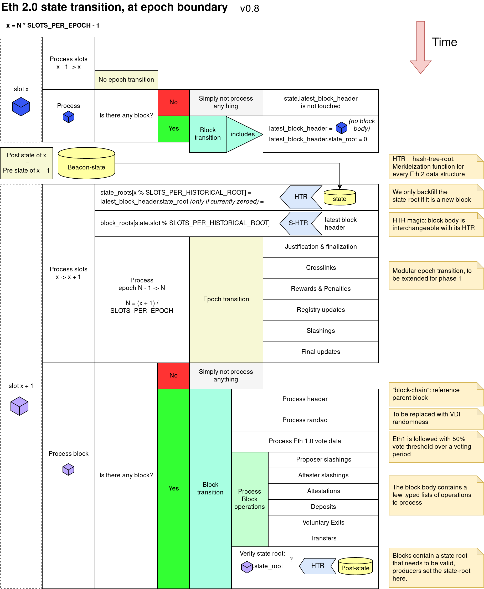

Spec: [https://github.com/ethereum/eth2.0-specs/blob/dev/specs/phase0/beacon-chain.md#beacon-chain-state-transition-function](https://github.com/ethereum/eth2.0-specs/blob/dev/specs/phase0/beacon-chain.md#beacon-chain-state-transition-function)

Annotated spec from Vitalik: [https://github.com/ethereum/annotated-spec/blob/master/phase0/beacon-chain.md](https://github.com/ethereum/annotated-spec/blob/master/phase0/beacon-chain.md)
Annotated spec from Ben (from Consensys): [https://benjaminion.xyz/eth2-annotated-spec/phase0/beacon-chain](https://benjaminion.xyz/eth2-annotated-spec/phase0/beacon-chain)

Visual depiction: [https://github.com/protolambda/eth2-docs#phase-0-beaconstate-transition](https://github.com/protolambda/eth2-docs#phase-0-beaconstate-transition)

Implementation:
- block: [https://github.com/status-im/nim-beacon-chain/blob/master/beacon_chain/spec/state_transition_block.nim](https://github.com/status-im/nim-beacon-chain/blob/master/beacon_chain/spec/state_transition.nim)
- epoch: [https://github.com/status-im/nim-beacon-chain/blob/master/beacon_chain/spec/state_transition_epoch.nim](https://github.com/status-im/nim-beacon-chain/blob/master/beacon_chain/spec/state_transition.nim)
- High-level API: [https://github.com/status-im/nim-beacon-chain/blob/master/beacon_chain/spec/state_transition.nim](https://github.com/status-im/nim-beacon-chain/blob/master/beacon_chain/spec/state_transition.nim) and [https://github.com/status-im/nim-beacon-chain/blob/master/beacon_chain/spec/state_transition_helpers.nim](https://github.com/status-im/nim-beacon-chain/blob/master/beacon_chain/spec/state_transition.nim)
Implementation follows the spec closely with an additional caching mechanism that avoids recomputing epoch invariants.

Tests:
- Ethereum Foundation vectors are loaded here: [https://github.com/status-im/nim-beacon-chain/tree/master/tests/official](https://github.com/status-im/nim-beacon-chain/tree/master/tests/official)
- Self-tests were added for attestations, deposits and justification/finalization
  - [https://github.com/status-im/nim-beacon-chain/tree/master/tests/spec_block_processing](https://github.com/status-im/nim-beacon-chain/tree/master/tests/spec_block_processing)
  - [https://github.com/status-im/nim-beacon-chain/tree/master/tests/spec_epoch_processing](https://github.com/status-im/nim-beacon-chain/tree/master/tests/spec_epoch_processing)

Fuzzing via [https://github.com/sigp/beacon-fuzz](https://github.com/sigp/beacon-fuzz) covers:
- attestation
- attester_slashing
- state transition for block
- deposit
- proposer slashing
- shuffling
- voluntary exit
