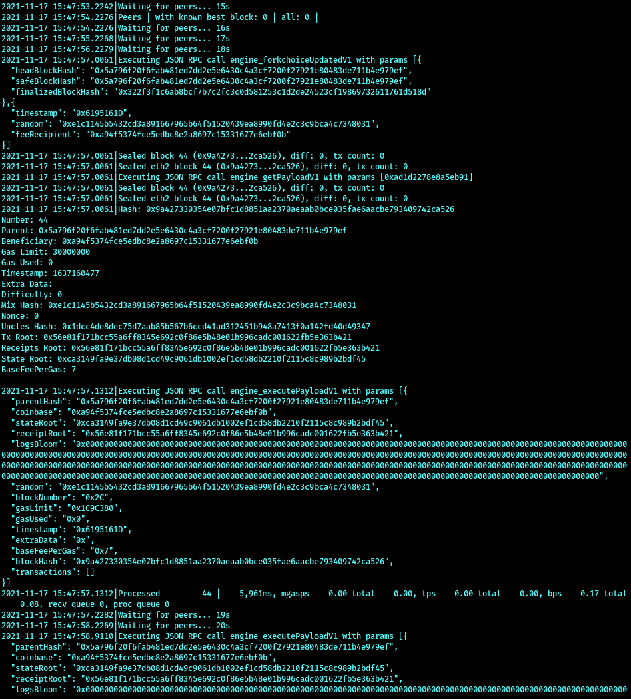

# How to run Nethermind
https://github.com/NethermindEth/nethermind/pull/3597 documents this aspect.

## Install dotnet:
```
https://dotnet.microsoft.com/download
```

## Build Nethermind:
```
git clone https://github.com/NethermindEth/nethermind.git --recursive -b themerge_kintsugi
cd src/Nethermind
dotnet build Nethermind.sln -c Release
# if src/Nethermind/Nethermind.Runner/bin/Release/net5.0/plugins has no Nethermind.Merge.Plugin.dll plugin then you may need to run the build again
dotnet build Nethermind.sln -c Release
cd Nethermind.Runner
```

# Run Nethermind
run Nethermind
```
rm -rf bin/Release/net5.0/nethermind_db
dotnet run -c Release -- --config themerge_kintsugi_m2 --Merge.TerminalTotalDifficulty 100
```

# Verify that Nimbus runs through test vectors

- Run `./env.sh nim c -r tests/test_merge_vectors.nim`. It should show output akin to:

```
$ ./env.sh nim c -r tests/test_merge_vectors.nim
[Suite] Merge test vectors
DBG 2021-11-17 15:31:31.560+00:00 Message sent to RPC server                 topics="JSONRPC-HTTP-CLIENT" tid=960621 file=httpclient.nim:191 address=127.0.0.1:9550 msg_len=79
DBG 2021-11-17 15:31:31.576+00:00 Message sent to RPC server                 topics="JSONRPC-HTTP-CLIENT" tid=960621 file=httpclient.nim:191 address=127.0.0.1:9550 msg_len=493
DBG 2021-11-17 15:31:31.597+00:00 Message sent to RPC server                 topics="JSONRPC-HTTP-CLIENT" tid=960621 file=httpclient.nim:191 address=127.0.0.1:9550 msg_len=87
DBG 2021-11-17 15:31:31.619+00:00 Message sent to RPC server                 topics="JSONRPC-HTTP-CLIENT" tid=960621 file=httpclient.nim:191 address=127.0.0.1:9550 msg_len=1196
DBG 2021-11-17 15:31:31.634+00:00 Message sent to RPC server                 topics="JSONRPC-HTTP-CLIENT" tid=960621 file=httpclient.nim:191 address=127.0.0.1:9550 msg_len=494
DBG 2021-11-17 15:31:31.637+00:00 Message sent to RPC server                 topics="JSONRPC-HTTP-CLIENT" tid=960621 file=httpclient.nim:191 address=127.0.0.1:9550 msg_len=87
DBG 2021-11-17 15:31:31.640+00:00 Message sent to RPC server                 topics="JSONRPC-HTTP-CLIENT" tid=960621 file=httpclient.nim:191 address=127.0.0.1:9550 msg_len=1197
DBG 2021-11-17 15:31:31.644+00:00 Message sent to RPC server                 topics="JSONRPC-HTTP-CLIENT" tid=960621 file=httpclient.nim:191 address=127.0.0.1:9550 msg_len=494
  [OK] getPayload, executePayload, and forkchoiceUpdated
```

# How to run Nimbus local testnet with Nethermind

- Run Nethermind.
- Check out `nimbus-eth2` branch `kintsugi`

- Run `./scripts/launch_local_testnet.sh --preset minimal --nodes 4 --disable-htop --stop-at-epoch 7 -- --verify-finalization --discv5:no`

This creates a 4-node local testnet with 128 validators.

The Nimbus console output will be similar to
```
nimbus-eth2$ N=0; while ./scripts/launch_local_testnet.sh --preset minimal --nodes 4 --disable-htop --stop-at-epoch 8 -- --verify-finalization --discv5:no; do N=$((N+1)); echo "That was run #${N}"; sleep 67; done
Building: build/nimbus_beacon_node
Building: build/nimbus_signing_process
Building: build/deposit_contract
Build completed successfully: build/nimbus_signing_process
Build completed successfully: build/deposit_contract
Build completed successfully: build/nimbus_beacon_node
NOT 2021-11-17 15:40:11.894+01:00 Generating deposits                        tid=966934 file=keystore_management.nim:562 totalNewValidators=128 validatorsDir=local_testnet_data/validators secretsDir=local_testnet_data/secrets
NOT 2021-11-17 15:40:51.434+01:00 Deposit data written                       tid=966934 file=deposit_contract.nim:222 filename=local_testnet_data/deposits.json
Wrote local_testnet_data/genesis.ssz
WRN 2021-11-17 15:40:51.443+01:00 Using insecure password to lock networking key key_path=local_testnet_data/network_key.json
INF 2021-11-17 15:40:52.184+01:00 New network key storage was created        topics="networking" key_path=local_testnet_data/network_key.json network_public_key=08021221029b0d9c63dc15335b6f1f73dc359a0bda88a84cc7e0346f12e64084673a35a915
Wrote local_testnet_data/bootstrap_nodes.txt
Wrote local_testnet_data/config.yaml:
DEPOSIT_NETWORK_ID: 1
PRESET_BASE: minimal
MIN_GENESIS_ACTIVE_VALIDATOR_COUNT: 128
MIN_GENESIS_TIME: 0
GENESIS_DELAY: 10
DEPOSIT_CONTRACT_ADDRESS: 0x0000000000000000000000000000000000000000
ETH1_FOLLOW_DISTANCE: 1
ALTAIR_FORK_EPOCH: 1
MERGE_FORK_EPOCH: 2
TERMINAL_TOTAL_DIFFICULTY: 0
That was run #1
```

Meanwhile, Nimbus is interacting with Nethermind in preparing, getting, and executing payloads:

