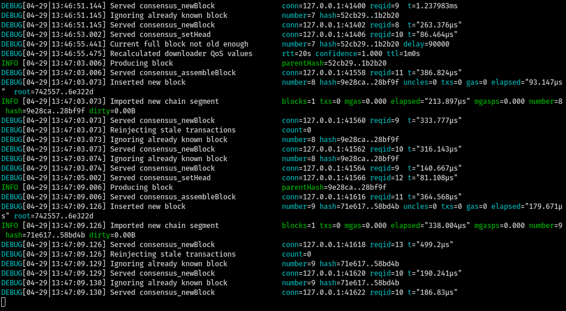
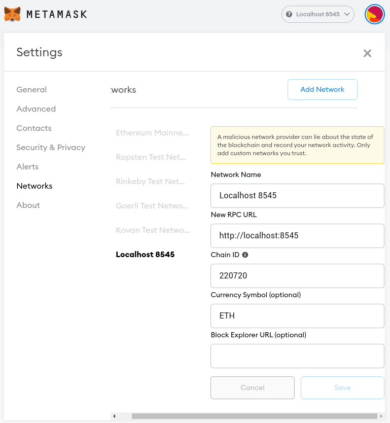
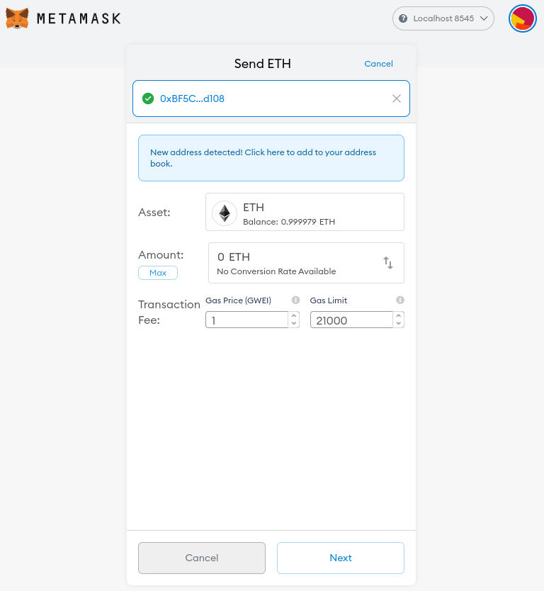
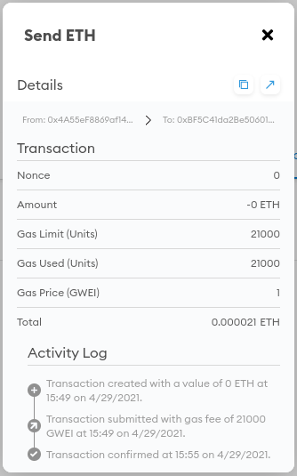

# How to run Catalyst

- Clone Geth master into ~/client/catalyst: `git clone https://github.com/ethereum/go-ethereum ~/client/catalyst`
- Build Geth and Catalyst with `go build -o ./build/bin/catalyst ./cmd/geth`
- Run `scripts/run-catalyst.sh` to run Catalyst. It listens on port 8545.

# Verify Catalyst is working

- Clone https://github.com/protolambda/mergenet-tutorial
- Navigate to `rpc_examples` and run `consensus_assembleBlock.sh`, `consensus_newBlock.sh`, `consensus_setHead.sh`, and `
get_genesis_hash.sh` to verify that Catalyst is properly configured.
- If issues present themselves here, or when Nimbus attempts to use the API, one can `debug.verbosity(4)` console command in Catalyst.

# How to run Nimbus

- Check out branch `quick-merge-v1`
- Run `./scripts/launch_local_testnet.sh --testnet 0 --nodes 4 --disable-htop --stop-at-epoch 8 -- --verify-finalization --discv5:no`

# How to post a transaction

- Set up the MetaMask Chrome extension and use the seed phrase corresponding to an address with funds at genesis.
- Configure the localhost:8545 network to use the Chain ID corresponding to the Catalyst chain configuration.

- Create a transaction from that address to another address.

- Run the local testnet to confirm the transaction.

