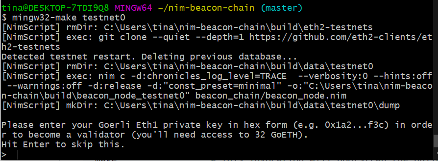
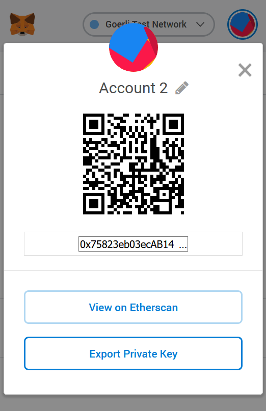
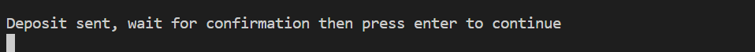

# Become a Validator

To become a validator, you have to first connect to a testnet, deposit your Ethers, and sync with the network.

## Recommended Testnets

Though Nimbus can connect to any of the testnets published in the [eth2-clients/eth2-testnets repo](https://github.com/eth2-clients/eth2-testnets/tree/master/nimbus), below are the recommended ones:

- Public Testnet: [witti](https://github.com/goerli/witti) ([explorer](https://witti.beaconcha.in))
- Local Testnet: testnet0

## Connecting to Testnets

Before we start, we have to obtain 32 Ethers on the Goerli testnet. Then, we can deposit 32 Ethers to the registration smart contract to become a validator.

1. Open your [MetaMask](https://metamask.io/) wallet, switch to the `Goerli Test Network` option from the top right cornor.
2. Copy your account address by clicking on one of your accounts.
3. Post your account address on a social media platform (Twitter or Facebook). Copy the url to the post.
4. Paste your post url on the [Goerli faucet](https://faucet.goerli.mudit.blog/) and select `Give me Ether > 37.5 Ethers` from the top right cornor of the page.
5. Wait for a few seconds and return to your MetaMask wallet to check if you have successfully received.
6. Once the [prerequisites](./install.md) are installed, you can connect to testnet0 with the following commands: <br>

- Change `testnet0` to `witti` to connect to the witti testnet.
- **_Remember to replace `make` with `mingw32-make` if using Windows._**

```bash
git clone https://github.com/status-im/nim-beacon-chain
cd nim-beacon-chain
git checkout devel
git pull
make update
make testnet0        # This will build Nimbus and all other dependencies
                     # and connect you to testnet0
```



7. The testnet should now be up and running. Then, you will be prompted to enter your private key of the account you want to deposit the 32 Etheres from. Find your private key from MetaMask as below:




8. Wait for a few seconds until you see your deposit has been sent:



9. Now you should be syncing with the network. It may take a while (may be quite a few hours). You can know that you are synced if you see the following output.


You can also get a brief estimate of the time remaining until your network gets synced by comparing the output `epoch` value and the one in the blockchain explorer (the [witti explorer](https://witti.beaconcha.in) for example).

## Trouble Shooting

1. The directory that stores the blockchain data of the testnet is `build/data/testnet0` (replace `testnet0` with other testnet names). Delete this folder if you want to start over. For example, you can start over with a fresh storgae if you entered a wrong private key.

2. Currently, you have to switch to the devel branch in order to run the validator node successfully.

3. Everytime you want to update your node to the latest version, run `git pull`, `make update`, and then `make testnet0`.
