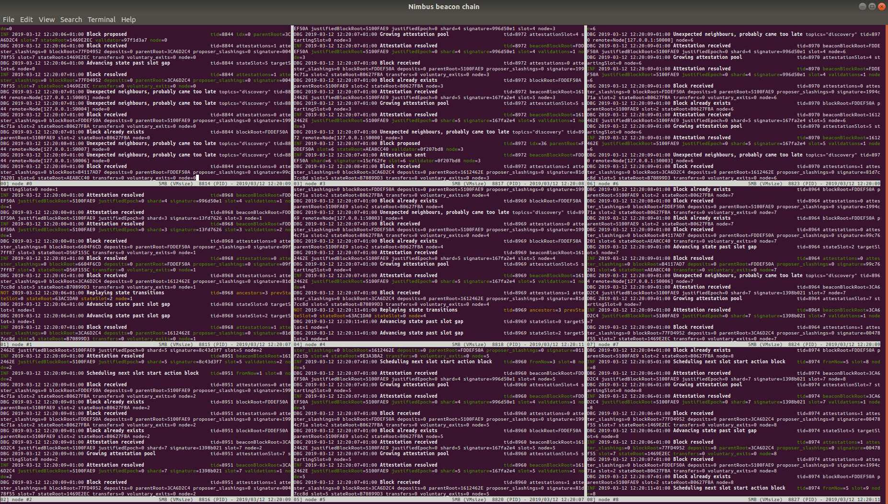

# For Developers

This page contains tips and tricks for developers, further resources, along with information on how to set up your build environment on your platform.

Before building Nimbus for the first time, make sure to install the [prerequisites](./install.md).

## Helpful resources

* [Ethereum consensus spec](https://github.com/ethereum/consensus-specs/)
* [Ben Edgington's annotated spec](https://eth2book.info/capella/)
* [Vitalik's annotated spec](https://github.com/ethereum/annotated-spec/blob/master/phase0/beacon-chain.md)

## Nim programming language

Nimbus is built in the [Nim language](https://nim-lang.org).
The compiler is automatically installed when building the project for the first time.

More information — in particular security-related information about the language — can be found in the [Auditor Handbook](https://nimbus.guide/auditors-book/).

## Code style

The code follows the [Status Nim Style Guide](https://status-im.github.io/nim-style-guide/).

## Branch lifecycle

The git repository has 3 main branches, `stable`, `testing` and `unstable` as well as feature and bugfix branches.

### Unstable

The `unstable` branch contains features and bugfixes that are actively being tested and worked on.

* Features and bugfixes are generally pushed to individual branches, each with their own pull request against the `unstable` branch.
* Once the branch has been reviewed and passed CI, the developer or reviewer merges the branch to `unstable`.
* The `unstable` branch is regularly deployed to the Nimbus Prater fleet where additional testing happens.

### Testing

The `testing` branch contains features and bugfixes that have gone through CI and initial testing on the `unstable` branch and are ready to be included in the next release.

* After testing a bugfix or feature on `unstable`, the features and fixes that are planned for the next release get merged to the `testing` branch either by the release manager or team members.
* The `testing` branch is regularly deployed to the Nimbus prater fleet as well as a smaller mainnet fleet.
* The branch should remain release-ready at most times.

### Stable

The `stable` branch tracks the latest released version of Nimbus and is suitable for mainnet staking.

## Build system

### Windows

```bash
mingw32-make # this first invocation will update the Git submodules
```

You can now follow the instructions in this this book by replacing `make` with `mingw32-make` (you should run `mingw32` regardless of whether you're running 32-bit or 64-bit architecture):

```bash
mingw32-make test # run the test suite
```

### Linux, macOS

After cloning the repo:

```bash
# Build nimbus_beacon_node and all the tools, using 4 parallel Make jobs
make -j4

# Run tests
make test

# Update to latest version
git pull
make update
```

## Environment

Nimbus comes with a build environment similar to Python venv.
This helps ensure that the correct version of Nim is used and that all dependencies can be found.

```bash
./env.sh bash # start a new interactive shell with the right env vars set
which nim
nim --version # Nimbus is tested and supported on 1.2.12 at the moment

# or without starting a new interactive shell:
./env.sh which nim
./env.sh nim --version

# Start Visual Studio code with environment
./env.sh code

```

## Makefile tips and tricks for developers

- build all those tools known to the Makefile:
  ```bash
  # $(nproc) corresponds to the number of cores you have
  make -j $(nproc)
  ```

- build a specific tool:
  ```bash
  make block_sim
  ```

- you can control the Makefile's verbosity with the V variable (defaults to 0):
  ```bash
  make V=1 # verbose
  make V=2 test # even more verbose
  ```

- same for the [Chronicles log level](https://github.com/status-im/nim-chronicles#chronicles_log_level):
  ```bash
  make LOG_LEVEL=DEBUG bench_bls_sig_aggregation # this is the default
  make LOG_LEVEL=TRACE nimbus_beacon_node # log everything
  ```

- pass arbitrary parameters to the Nim compiler:
  ```bash
  make NIMFLAGS="-d:release"
  ```

- you can freely combine those variables on the `make` command line:
  ```bash
  make -j$(nproc) NIMFLAGS="-d:release" USE_MULTITAIL=yes local-testnet-minimal
  ```

- don't use the [lightweight stack tracing implementation from nim-libbacktrace](https://github.com/status-im/nimbus-eth2/pull/745):
  ```bash
  make USE_LIBBACKTRACE=0 # expect the resulting binaries to be 2-3 times slower
  ```

- disable `-march=native` because you want to run the binary on a different machine than the one you're building it on:
  ```bash
  make NIMFLAGS="-d:disableMarchNative" nimbus_beacon_node
  ```

- disable link-time optimization (LTO):
  ```bash
  make NIMFLAGS="-d:disableLTO" nimbus_beacon_node
  ```

- show C compiler warnings:
  ```bash
  make NIMFLAGS="-d:cwarnings" nimbus_beacon_node
  ```

- limit stack usage to 1 MiB per C function (static analysis - see the [GCC docs](https://gcc.gnu.org/onlinedocs/gnat_ugn/Static-Stack-Usage-Analysis.html); if LTO is enabled, it works without `-d:cwarnings`):
  ```bash
  make NIMFLAGS="-d:limitStackUsage" nimbus_beacon_node
  ```

- build a static binary:
  ```bash
  make NIMFLAGS="--passL:-static" nimbus_beacon_node
  ```

- publish a book using [mdBook](https://github.com/rust-lang/mdBook) from sources in "docs/" to GitHub pages:
  ```bash
  make publish-book
  ```

- create a binary distribution:
  ```bash
  make dist
  ```

## Multi-client interop scripts

[This repository](https://github.com/eth2-clients/multinet) contains a set of scripts used by the client implementation teams to test interop between the clients (in certain simplified scenarios).
It mostly helps us find and debug issues.

## Stress-testing the client by limiting the CPU power

```bash
make prater CPU_LIMIT=20
```

The limiting is provided by the `cpulimit` utility, available on Linux and macOS.
The specified value is a percentage of a single CPU core.
Usually 1 - 100, but can be higher on multi-core CPUs.

## Build and run the local beacon chain simulation

The beacon chain simulation runs several beacon nodes on the local machine, attaches several local validators to each, and builds a beacon chain between them.

To run the simulation:

```bash
make update
make local-testnet-minimal
```

To clean the previous run's data:

```bash
make clean_eth2_network_simulation_all
```

To change the number of validators and nodes:

```bash
# Clear data files from your last run and start the simulation with a new genesis block:
make VALIDATORS=192 NODES=6 USER_NODES=1 local-testnet-minimal
```

If you’d like to see the nodes running on separated sub-terminals inside one big window, install [Multitail](https://www.vanheusden.com/multitail/) (if you're on a Mac, follow the instructions [here](https://brewinstall.org/Install-multitail-on-Mac-with-Brew/)), then:


```
USE_MULTITAIL="yes" make local-testnet-minimal
```

You’ll get something like this (click for full size):

[](./img/developers_01.png)


You can find out more about the beacon node simulation [here](https://our.status.im/nimbus-development-update-03/#beaconsimulation).

## Build and run the local state transition simulation

This simulation is primarily designed for researchers, but we'll cover it briefly here in case you're curious :)

The [state transition](https://github.com/ethereum/annotated-spec/blob/master/phase0/beacon-chain.md#beacon-chain-state-transition-function) simulation quickly runs the beacon chain state transition function in isolation and outputs JSON snapshots of the state (directly to the `nimbus-eth2` directory).
It runs without networking and blocks are processed without slot time delays.

```bash
# build the state simulator, then display its help ("-d:release" speeds it
# up substantially, allowing the simulation of longer runs in reasonable time)
make NIMFLAGS="-d:release" block_sim
build/block_sim --help
```

Use the output of the `help` command to pass desired values to the simulator.
Experiment with changing the number of slots, validators, etc. to get different results.

The most important options are:

- `slots`: the number of slots to run the simulation for (default 192)
- `validators`: the number of validators (default 6400)
- `attesterRatio`: the expected fraction of attesters that actually do their work for every slot (default 0.73)

For example, to run the block simulator for 384 slots, with 20,000 validators, and an average of 66% of attesters doing their work every slot, run:

```
build/block_sim --slots=384 --validators=20000 --attesterRatio=0.66
```

