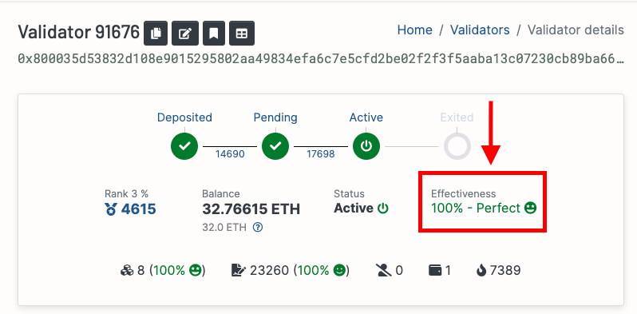

# Monitor the health of your node

The most important thing for the health, performance and stability of your node and the overall network is the strength of your node's network connectivity / peer count.

See [here](./networking.md) for our networking related tips and tricks.

## Keep track of your attestation effectiveness

Attestation effectiveness is a metric that directly affects your validator rewards.

The interval between a validator performing its duty and an attestation is called the *inclusion distance* of an attestation.
As long as your validator is within the allowed inclusion distance, you will get the full reward.

You can verify your validator's effectiveness on the [beaconcha.in](https://beaconcha.in/) website.



Ideally you want to see a value above 95%.

While attestation effectiveness depends on a variety of factors — attestation network propagation, your network connectivity, and the peers you are connected to — your network connectivity is likely the most important factors you can control to improve this metric.
Apart from the tips outlined on this guide, you could also experiment with [subscribing to all subnets](./profits.md#subscribe-to-all-subnets).

## Monitor your system's network I/O usage

If you're a Linux user and want to track how much network I/O your system uses over time, you can install a nice utility called [`vnstat`](https://humdi.net/vnstat/).

To install, run:

```sh
sudo apt install vnstat
```

To run it:

*TBC - See [here](https://docs.rocketpool.net/guides/node/performance#beaconcha-in-website-using-the-beacon-chain-as-a-metric-source) for more info*

