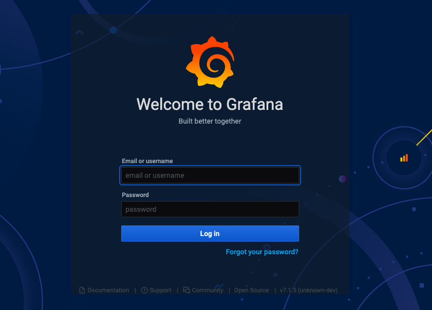

# Grafana and Prometheus

In this page we'll cover how to use Grafana and Prometheus to help you visualize important real-time metrics concerning your validator and/or beacon node.

Prometheus is an open-source systems monitoring and alerting toolkit.
It runs as a service on your computer and its job is to capture metrics.
You can find more information about Prometheus [here](https://prometheus.io/docs/introduction/overview/).

Grafana is a tool for beautiful dashboard monitoring that works well with Prometheus.
You can learn more about Grafana [here](https://github.com/grafana/grafana).

## Simple metrics

To enable the metrics server, run the beacon node  with the `--metrics` flag:

```
./run-prater-beacon-node.sh --metrics
```

Visit [http://127.0.0.1:8008/metrics](http://127.0.0.1:8008/metrics) with a browser or `curl`.
You should see a plaintext page that looks something like this:

```
# HELP nim_runtime_info Nim runtime info
# TYPE nim_runtime_info gauge
nim_gc_mem_bytes 6275072.0
nim_gc_mem_occupied_bytes 1881384.0
nim_gc_heap_instance_occupied_bytes{type_name="KeyValuePairSeq[digest.Eth2Digest, block_pools_types.BlockRef]"} 25165856.0
nim_gc_heap_instance_occupied_bytes{type_name="BlockRef"} 17284608.0
nim_gc_heap_instance_occupied_bytes{type_name="string"} 6264507.0
nim_gc_heap_instance_occupied_bytes{type_name="seq[SelectorKey[asyncdispatch.AsyncData]]"} 409632.0
nim_gc_heap_instance_occupied_bytes{type_name="OrderedKeyValuePairSeq[Labels, seq[Metric]]"} 122720.0
nim_gc_heap_instance_occupied_bytes{type_name="Future[system.void]"} 79848.0
nim_gc_heap_instance_occupied_bytes{type_name="anon ref object from /Users/hackingresearch/nimbus/clone/nim-beacon-chain/vendor/nimbus-build-system/vendor/Nim/lib/pure/asyncmacro.nim(319, 33)"} 65664.0
nim_gc_heap_instance_occupied_bytes{type_name="anon ref object from /Users/hackingresearch/nimbus/clone/nim-beacon-chain/vendor/nimbus-build-system/vendor/Nim/lib/pure/asyncnet.nim(506, 11)"} 43776.0
nim_gc_heap_instance_occupied_bytes{type_name="seq[byte]"} 37236.0
nim_gc_heap_instance_occupied_bytes{type_name="seq[TrustedAttestation]"} 29728.0

...
```

!!! note
    Metrics are by default only accessible from the same machine as the beacon node is running on.
    To fetch metrics from a remote machine, an SSH tunnel is recommended.

<!-- TODO: Create a reference page with all metrics for each of the products (beacon node and validator client) -->

The metrics server offers one snapshot in time of the state of the beacon node.
Metrics, however, are at their most useful when collected over time — for this, we'll need to set up two more pieces of software: Prometheus and Grafana.

## Prometheus and Grafana

The following steps will take you through how to use Prometheus and Grafana to spin up a beautiful and useful monitoring dashboard for your validator and beacon node.

### Steps

#### 1. Download Prometheus

Use your favourite package manager to download Prometheus: for example `apt-get install prometheus` on Ubuntu, or `brew install prometheus` on MacOS, should do the trick.

!!! note
    If you don't use a package manager, you can download the [latest release](https://prometheus.io/download/) of directly from Prometheus website. To extract it, run:

    ```
    tar xvfz prometheus-*.tar.gz
    cd prometheus-*
    ```


#### 2. Copy the binary

The Prometheus server is a single binary called prometheus (or prometheus.exe on Microsoft Windows).
Copy it over to [`/usr/local/bin`](https://unix.stackexchange.com/questions/4186/what-is-usr-local-bin):

```
cp prometheus-2.20.1.linux-amd64/prometheus /usr/local/bin/
```

#### 3. Run Prometheus with the default configuration file

Prometheus relies on a YAML configuration file to let it know where, and how often, to scrape data.

Example config file:

```
global:
  scrape_interval: 12s

scrape_configs:
  - job_name: "nimbus"
    static_configs:
      - targets: ['127.0.0.1:8008']

```

Save the above as `prometheus.yml` in the `nimbus-eth2` repo.

Then run Prometheus:

```
prometheus --config.file=./prometheus.yml --storage.tsdb.path=./prometheus
```

You should see the following confirmation in the logs:

```
level=info ts=2021-01-22T14:52:10.604Z caller=main.go:673 msg="Server is ready to receive web requests."
```

#### 4. Download Grafana

[Download the latest release](https://grafana.com/grafana/download?platform=linux) of Grafana for your platform.
You need version 7.2 or newer.

!!! note
    If you use a package manager, you can also download Grafana that way -- for example `apt-get install grafana` on Ubuntu, or `brew install grafana` on MacOS, should do the trick.

#### 5. Install and start Grafana

Follow [the instructions for your platform](https://grafana.com/docs/grafana/latest/installation/) to install and start Grafana.

#### 6. Configure login

Go to [http://localhost:3000/](http://localhost:3000/), you should see a Grafana login screen that looks like this:




Type in `admin` for both the username and password.
You'll be asked to change the password (and we recommend you do so).


#### 7. Add a data source

Hover your mouse over the gear icon in the left menu bar, and click on the `Data Sources` option in the sub-menu that pops up.


Now click on the `Add Data Source` button in the center of the screen


Select `Prometheus`


Enter `http://localhost:9090` in the URL field


Set the "Scrape interval" field to the same value you used in the Prometheus config ("15s" in our example below).

Scroll to the bottom and click on `Save and Test`


If everything is working correctly you should see a green `Data source is working` box pop up


#### 8. Import a dashboard

Now, let's import a dashboard; hover your mouse over the `+` icon in the left menu bar and select `import` from the pop-up menu


Click on `Upload JSON file`


Select the `beacon_nodes_Grafana_dashboard.json`  from the `nimbus-eth2/grafana/` folder and click on `Import`


You'll be directed to the dashboard where you'll be able to gain insights into the performance of `nimbus-eth2` and your validators


!!! note
    The dashboard is very much a work in progress.
    Some of the highlights right now include received and proposed blocks, received and sent attestations, peers, memory and cpu usage stats.
    But keep an eye out for additional metrics in the near future.


And voilà! That's all there is to it :)


## Community dashboards

### Joe Clapis


Joe — who’s done some brilliant work [integrating Nimbus with Rocket Pool](https://our.status.im/rocket-pool-integration/) — has created a [wonderful guide](https://github.com/jclapis/rp-pi-guide/blob/main/Grafana.md) where he takes you through how to set up a Grafana server on your Pi, using his dashboard as an example.

In his words:

> This captures just about every metric I think I’d like to see at a glance.

Whether or not you're running a Pi, we recommend you check out [his guide]( https://github.com/jclapis/rp-pi-guide/blob/main/Grafana.md).


### Metanull


A dashboard aimed primarily at users rather than developers.

Note that this dashboard does rely heavily on three prometheus exporter tools: `node_exporter` for system metrics, `json_exporter` for ETH price, and `blackbox_exporter` for ping times.

The good news is that you don't need to use all these tools, as long as you take care of removing the related panels.

See [here](https://github.com/metanull-operator/eth2-grafana/tree/master/nimbus) for a detailed guide explaining how to use it.

