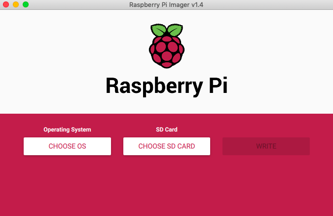
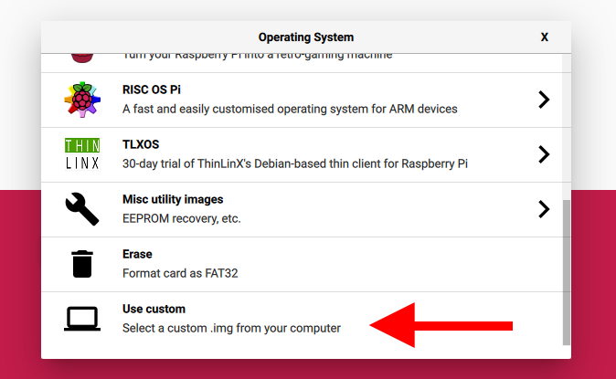
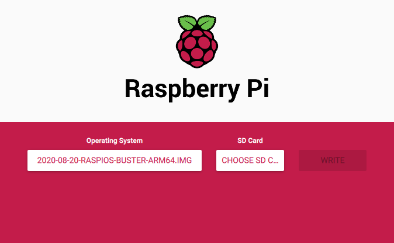
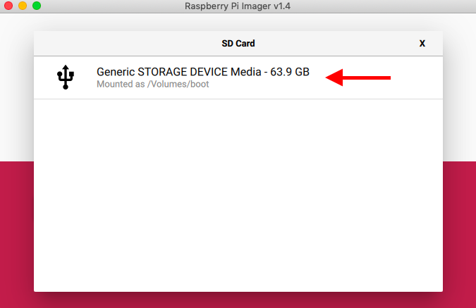
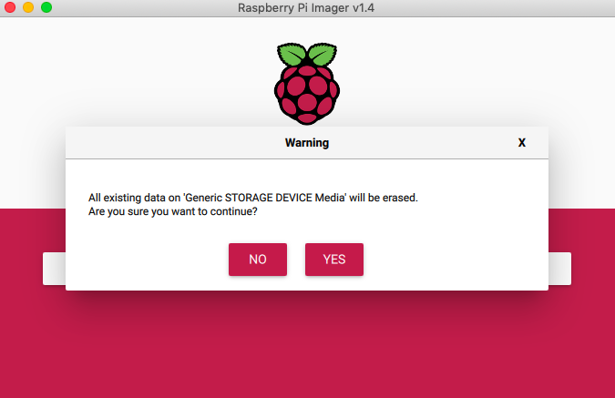

# Running on a Raspberry Pi

<blockquote class="twitter-tweet"><p lang="en" dir="ltr">I expect the new Raspberry Pi 4 (4GB RAM option, external SSD) to handle an Eth2 validator node without breaking a sweat. That&#39;s $100 of hardware running at 10 Watts to support a 32 ETH node (currently ~$10K stake).</p>&mdash; Justin Ðrake (@drakefjustin) <a href="https://twitter.com/drakefjustin/status/1143091047058366465?ref_src=twsrc%5Etfw">June 24, 2019</a></blockquote> <script async src="https://platform.twitter.com/widgets.js" charset="utf-8"></script>

In addition to this guide, we highly recommend this [wonderful and complementary resource](https://docs.rocketpool.net/guides/node/local/prepare-pi.html#preliminary-setup) by community member Joe Clapis.

## Introduction

This page will take you through how to use your laptop to program your Raspberry Pi.

One of the most important aspects of the Raspberry Pi experience is trying to make it as easy as possible to get started.
As such, we try our best to explain things from first-principles.

## Prerequisites

- Raspberry Pi 4 4GB (8GB recommended if also running execution client)
- 64GB microSD Card
- microSD USB adapter
- 5V 3A USB-C charger
- Reliable Wi-Fi connection
- Laptop
- Basic understanding of the [command line](https://www.learnenough.com/command-line-tutorial/basics)
- 200GB SSD (2TB recommended if also running execution client)

!!! note
    You will need an SSD to run the Nimbus: mechanical hard drives are typically too slow to run an Ethereum node.
    You have two options:

    1. Use an USB portable SSD disk such as the Samsung T5 Portable SSD.
    2. Use an USB 3.0 External Hard Drive Case with a SSD Disk.
       For example, [Ethereum on Arm](https://twitter.com/EthereumOnARM) use an Inateck 2.5 Hard Drive Enclosure FE2011.
       Make sure to buy a case with an UASP compliant chip, particularly, one of these: JMicron (JMS567 or JMS578) or ASMedia (ASM1153E).

    In both cases, avoid low quality SSD disks (the SSD is a key component of your node and can drastically affect both the performance and sync time).
    Keep in mind that you need to plug the disk to an USB 3.0 port (the blue port).

!!! note
    If you have a Raspberry Pi 4 and are getting bad speeds transferring data to/from USB3.0 SSDs, please [read this recommended fix](https://forums.raspberrypi.com/viewtopic.php?t=245931#p1501426).

## Steps

### 1. Download Raspberry Pi Imager

[Raspberry Pi Imager](https://www.raspberrypi.org/blog/raspberry-pi-imager-imaging-utility/) is an imaging utility that makes it simple to manage your microSD card with Raspberry Pi OS (the free Pi operating system based on Debian, previously called Raspbian).

You can find the download link for your operating system here: [Windows](https://downloads.raspberrypi.org/imager/imager_1.4.exe), [macOS](https://downloads.raspberrypi.org/imager/imager_1.4.dmg), [Ubuntu](https://downloads.raspberrypi.org/imager/imager_1.4_amd64.deb).

### 2. Download 64-bit Raspberry Pi OS

You need to install the 64-bit version of Raspberry Pi OS.
You can find the latest version, [here](https://downloads.raspberrypi.org/raspios_arm64/images/).

### 3. Plug in SD card

Use your microSD to USB adapter to plug the SD card into your computer.

### 4. Download Raspberry Pi OS

Open Raspberry Pi Imager and click on **CHOOSE OS**:



Scroll down and click on **Use custom**:



Find the OS you downloaded in step 2:



### 4b. Write to SD card

Click on **CHOOSE SD CARD**.
You should see a menu pop-up with your SD card listed -- Select it



Click on **WRITE**


Click **YES**



Make a cup of coffee :)

### 5. Set up wireless LAN

Since you have loaded Raspberry Pi OS onto a blank SD card, you will have two partitions.
The first one, which is the smaller one, is the `boot` partition.

Create a `wpa_supplicant` configuration file in the `boot` partition with the following content:

```
# wpa_supplicant.conf

ctrl_interface=DIR=/var/run/wpa_supplicant GROUP=netdev
update_config=1
country=<Insert 2 letter ISO 3166-1 country code here>

network={
    ssid="<Insert your Wifi network's name here>"
    psk="<Insert your Wifi network's password here>"
}
```

!!! note
    Don't forget to replace the placeholder `country`, `ssid`, and `psk` values.
    See [Wikipedia](https://en.wikipedia.org/wiki/ISO_3166-1) for a list of 2 letter `ISO 3166-1` country codes.

### 6. Enable SSH (using Linux or macOS)

You can [access the command line](https://www.raspberrypi.com/documentation/computers/remote-access.html) of a Raspberry Pi remotely from another computer or device on the same network using [SSH](https://en.wikipedia.org/wiki/Ssh_(Secure_Shell)).

While SSH is not enabled by default, you can enable it by placing a file named `ssh`, without any extension, onto the boot partition of the SD card.

When the Pi boots, it will look for the `ssh` file.
If it is found, SSH is enabled and the file is deleted.
The content of the file does not matter; it can contain text, or nothing at all.

To create an empty `ssh` file, from the home directory of the `boot` partition file, run:

```sh
touch ssh
```

### 7. Find your Pi's IP address

Since Raspberry Pi OS supports [Multicast_DNS](https://en.wikipedia.org/wiki/Multicast_DNS) out of the box, you can reach your Raspberry Pi by using its hostname and the `.local` suffix.

The default hostname on a fresh Raspberry Pi OS install is `raspberrypi`, so any Raspberry Pi running Raspberry Pi OS should respond to:

```sh
ping raspberrypi.local
```

The output should look more or less as follows:

```sh
PING raspberrypi.local (195.177.101.93): 56 data bytes
64 bytes from 195.177.101.93: icmp_seq=0 ttl=64 time=13.272 ms
64 bytes from 195.177.101.93: icmp_seq=1 ttl=64 time=16.773 ms
64 bytes from 195.177.101.93: icmp_seq=2 ttl=64 time=10.828 ms
...
```

Keep note of your Pi's IP address.
In the above case, that's `195.177.101.93`

### 8. SSH (using Linux or macOS)

Connect to your Pi by running:

```sh
ssh pi@195.177.101.93
```

You'll be prompted to enter a password:
```
pi@195.177.101.93's password:
```

Enter the Pi's default password: `raspberry`

You should see a message that looks like the following:
```
Linux raspberrypi 5.4.51-v8+ #1333 SMP PREEMPT Mon Aug 10 16:58:35 BST 2020 aarch64

The programs included with the Debian GNU/Linux system are free software;
the exact distribution terms for each program are described in the
individual files in /usr/share/doc/*/copyright.

Debian GNU/Linux comes with ABSOLUTELY NO WARRANTY, to the extent
permitted by applicable law.
Last login: Thu Aug 20 12:59:01 2020

SSH is enabled and the default password for the 'pi' user has not been changed.
This is a security risk - please login as the 'pi' user and type 'passwd' to set a new password.
```

Followed by a command-line prompt indicating a successful connection:

```sh
pi@raspberrypi:~ $
```

### 9. Increase swap size to 2GB

The first step is to increase the [swap size](https://itsfoss.com/swap-size/) to 2GB (2048MB).

!!! note
    Swap acts as a breather to your system when the RAM is exhausted.
    When the RAM is exhausted, your Linux system uses part of the hard disk memory and allocates it to the running application.


Use the Pi's built-in text editor [nano](https://www.nano-editor.org/dist/latest/cheatsheet.html) to open up the swap file:

```sh
sudo nano /etc/dphys-swapfile
```


Change the value assigned to `CONF_SWAPSIZE` from `100` to `2048`:

```
...

# set size to absolute value, leaving empty (default) then uses computed value
#   you most likely don't want this, unless you have a special disk situation
CONF_SWAPSIZE=2048

...

```

Save (`Ctrl+S`) and exit (`Ctrl+X`).


### 10. Reboot

Reboot your Pi to have the above changes take effect:

```sh
sudo reboot
```

This will cause your connection to close.
So you'll need to `ssh` into your Pi again:

```sh
ssh pi@195.177.101.93
```

!!! note
    Remember to replace `195.177.101.93` with the IP address of your Pi.


### 10b. Boot from external SSD

Follow [this RPi4 guide](https://www.tomshardware.com/how-to/boot-raspberry-pi-4-usb) to copy the contents of your SD card over to your SSD, and boot your Pi from your SSD.

!!! tip
    Make sure you connect your SSD the Pi's USB 3 port (the blue port).

    If your Pi is headless (no monitor attached) you can use the [`rpi-clone`](https://github.com/billw2/rpi-clone) repository to copy the contents of the SD over to the SSD; in a nutshell, replace steps 14 and 15 of the above guide with the following commands (which you should run from the Pi's `home` directory):

    ```sh
    git clone https://github.com/billw2/rpi-clone.git
    cd rpi-clone
    sudo cp rpi-clone rpi-clone-setup /usr/local/sbin
    sudo rpi-clone-setup -t testhostname
    rpi-clone sda
    ```

For more on `raspi-config`, see [here](https://www.raspberrypi.com/documentation/computers/configuration.html).

!!! tip
    To shutdown your Pi safely, run `sudo shutdown -h now`

Once you're done, `ssh` back into your Pi.


### 11. Overclocking

Nimbus requires the Raspberry Pi to be overclocked.

To overclock your Raspberry Pi, you need to add two lines to the `/boot/firmware/usercfg.txt` file:

```sh
sudo nano /boot/firmware/usercfg.txt
```

Add the following two lines to the end of the file:

```
arm_freq=1800
over_voltage=3
```

Save the file and reboot.
This increases the CPU clock from 1500 MHz to 1800 MHz and raises the CPU voltage from 0.88 V to 0.93 V.

To read more about testing the stability of an overclock and benchmarking, follow the [RPi overclocking guide](https://docs.rocketpool.net/guides/node/local/prepare-pi.html#overclocking-the-pi) by Joe Clapis.


### 12. Install the beacon node

=== "Using package manager"

    1. Add Status APT repository to your system.

        ```sh
        echo 'deb https://apt.status.im/nimbus all main' | sudo tee /etc/apt/sources.list.d/nimbus.list

        # Import the GPG key used to sign the releases:
        sudo curl https://apt.status.im/pubkey.asc -o /etc/apt/trusted.gpg.d/apt-status-im.asc
        ```


    2. Install Nimbus using APT:

        ```sh
        sudo apt-get update
        sudo apt-get install nimbus-beacon-node nimbus-validator-client
        ```

=== "Manual installation"

    Open the [Nimbus eth2 releases page](https://github.com/status-im/nimbus-eth2/releases/latest), go to the Assets on the bottom of the page, and copy the link for the file that starts with `nimbus-eth2_Linux_arm64v8`.

    Run this in your home directory to download nimbus-eth2:

    ```sh
    mkdir nimbus-eth2
    wget <insert download link here>
    tar -xzf nimbus-eth2_Linux_arm64v8*.tar.gz -C nimbus-eth2
    rm nimbus-eth2_Linux_arm64v8*.tar.gz
    ```

    Now you can find the software in the nimbus-eth2 directory.


### 13. Copy signing key over to Pi

!!! note
    If you haven't generated your validator key(s) and/or made your deposit yet, follow the [deposit instructions](./run-a-validator.md#1-make-a-deposit-for-your-validator) of our validator guide before carrying on.

We'll use the `scp` command to send files over SSH.
It allows you to copy files between computers, say from your Raspberry Pi to your desktop/laptop, or vice-versa.

Copy the folder containing your validator key(s) from your computer to your `pi`'s home folder by opening up a new terminal window and running the following command:

```sh
scp -r <VALIDATOR_KEYS_DIRECTORY> pi@195.177.101.93:
```

!!! note
    Don't forget the colon (:) at the end of the command!

As usual, replace `195.177.101.93` with your Pi's IP address, and `<VALIDATOR_KEYS_DIRECTORY>` with the full pathname of your `validator_keys` directory (if you used the Launchpad [command line app](https://github.com/ethereum/eth2.0-deposit-cli/releases/) this would have been created for you when you generated your keys).


!!! tip
    Run `pwd` in your `validator_keys` directory to print the full pathname to the console.


### 14. Import signing key into Nimbus

Depending on your installation method, run these commands to import your signing key into Nimbus:

=== "Using package manager"

    ```sh
    # Run import command as the `nimbus` user
    sudo -u nimbus /usr/bin/nimbus_beacon_node deposits import --data-dir=/var/lib/nimbus/shared_holesky_0 /path/to/keys
    ```

=== "Manual installation"

    To import your signing key into Nimbus, from the `nimbus-eth2` directory run.

    ```sh
    build/nimbus_beacon_node deposits import --data-dir=build/data/shared_holesky_0 ../validator_keys
    ```

 You'll be asked to enter the password you created to encrypt your keystore(s).
 Don't worry, this is entirely normal.
 Your validator client needs both your signing keystore(s) and the password encrypting it to import your [key](https://blog.ethereum.org/2020/05/21/keys/) (since it needs to decrypt the keystore in order to be able to use it to sign on your behalf).


### 15. Connect to Holesky

We're finally ready to connect to the Holesky testnet!

!!! note
    If you haven't already, we recommend registering for, and running, your own eth1 node in parallel.
    For instructions on how to do so, see the [eth1 page](./eth1.md).

To connect to Holesky, run:

=== "Using package manager"

    ```sh
    sudo -u nimbus /usr/bin/nimbus_beacon_node --network=holesky --data-dir=/var/lib/nimbus/shared_holesky_0
    ```

=== "Manual installation"

    ```sh
    ./run-holesky-beacon-node.sh
    ```


### 16. Check for successful connection

If you look near the top of the logs printed to your console, you should see confirmation that your beacon node has started, with your local validator attached:

```
INF 2023-10-01 11:25:33.487+01:00 Launching beacon node
...
INF 2023-10-01 11:25:34.556+01:00 Loading block dag from database            topics="beacnde" tid=19985314 file=nimbus_beacon_node.nim:198 path=build/data/shared_holesky_0/db
INF 2023-10-01 11:25:35.921+01:00 Block dag initialized
INF 2023-10-01 11:25:37.073+01:00 Generating new networking key
...
NTC 2023-10-01 11:25:45.267+00:00 Local validator attached                   tid=22009 file=validator_pool.nim:33 pubkey=95e3cbe88c71ab2d0e3053b7b12ead329a37e9fb8358bdb4e56251993ab68e46b9f9fa61035fe4cf2abf4c07dfad6c45 validator=95e3cbe8
...
NTC 2023-10-01 11:25:59.512+00:00 Eth1 sync progress                         topics="eth1" tid=21914 blockNumber=3836397 depositsProcessed=106147
NTC 2023-10-01 11:26:02.574+00:00 Eth1 sync progress                         topics="eth1" tid=21914 blockNumber=3841412 depositsProcessed=106391
...
INF 2023-10-01 11:26:31.000+00:00 Slot start                                 topics="beacnde" tid=21815 file=nimbus_beacon_node.nim:505 lastSlot=96566 scheduledSlot=96567 beaconTime=1w6d9h53m24s944us774ns peers=7 head=b54486c4:96563 headEpoch=3017 finalized=2f5d12e4:96479 finalizedEpoch=3014
INF 2023-10-01 11:26:36.285+00:00 Slot end                                   topics="beacnde" tid=21815 file=nimbus_beacon_node.nim:593 slot=96567 nextSlot=96568 head=b54486c4:96563 headEpoch=3017 finalizedHead=2f5d12e4:96479 finalizedEpoch=3014
```

To keep track of your syncing progress, have a look at the output at the very bottom of the terminal window in which your validator is running.
You should see something like:

```
peers: 15 ❯ finalized: ada7228a:8765 ❯ head: b2fe11cd:8767:2 ❯ time: 9900:7 (316807) ❯ sync: wPwwwwwDwwDPwPPPwwww:7:1.2313:1.0627:12h01m(280512)
```

Keep an eye on the number of peers you're currently connected to (in the above case that's `15`), as well as your [sync progress](./keep-an-eye.md#syncing-progress).

!!! note
    15 - 20 peers and an average sync speed of **0.5 - 1.0** blocks per second is normal on `Holesky` with a Pi.
    If your sync speed is much slower than this, the root of the problem may be your USB3.0 to SSD adapter.
    See [this post](https://forums.raspberrypi.com/viewtopic.php?f=28&t=245931) for a recommended workaround.


## Mainnet advice

Whether or not your Pi is up to the task will depend on a number of factors such as SSD speed, network connectivity, etc.
As such, it's best to verify performance on a testnet first.

The best thing you can do is to set your Pi to run Holesky.
If you have no trouble syncing and attesting on Holesky, your setup should good enough for mainnet as well.

<blockquote class="twitter-tweet" data-conversation="none"><p lang="en" dir="ltr">We&#39;ve been running lots of PIs and NanoPCs 24/7 for 3 years and never got a hardware fail. It is easy (and cheap) to get redundancy of components (even spare PIs in different locations, more of this to come).</p>&mdash; Ethereum on ARM (@EthereumOnARM) <a href="https://twitter.com/EthereumOnARM/status/1332772217420177408?ref_src=twsrc%5Etfw">November 28, 2020</a></blockquote> <script async src="https://platform.twitter.com/widgets.js" charset="utf-8"></script>

Although we don't expect a modern Pi to fail, we recommend buying a spare Pi, and enterprise grade SSD, on the off-chance it does; keep your original SD around, to make it easy for you to copy the image over.


### Systemd

Now that you have Nimbus up and running, we recommend [setting up a systemd service](https://www.raspberrypi.com/documentation/computers/remote-access.html#server-configuration) with an autorestart on boot (should you experience an unexpected power outage, this will ensure your validator restarts correctly).

Systemd will also ensure your validator keeps running when you exit your ssh session (`Ctrl-C`) and/or switch off your laptop.


For the details on how to do this, see our [systemd guide](./beacon-node-systemd.md).
