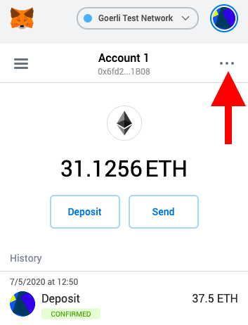
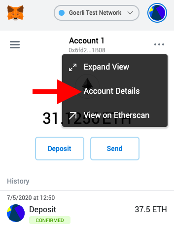
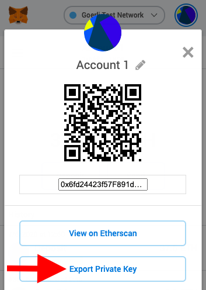
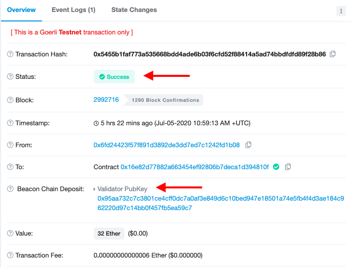

# Become a Validator

To become a validator, you need to install the beacon chain software, acquire 32 ETH, set up your validator account, and register with the deposit contract on ethereum.

There is currently no eth2 mainnet - all networks are testnets.

## Recommended Testnets

Though Nimbus can connect to any of the testnets published in the [eth2-clients/eth2-testnets repo](https://github.com/eth2-clients/eth2-testnets/tree/master/nimbus), below are the recommended ones:

- Multi-client Testnet: [altona](https://github.com/goerli/altona) ([explorer](https://altona.beaconcha.in))
- Nimbus Testnet: testnet0 (experimental, not always active)

## Altona

### Initial setup

Before we start, we have to obtain 32 ETH on the Goerli testnet (later on, we'll need to send this ETH to the deposit contract in order to become a validator).

1. Open your [MetaMask](https://metamask.io/) wallet, switch to the `Goerli Test Network` option from the top right corner.
2. Copy your account address by clicking on one of your accounts.
3. Post your account address on a social media platform (Twitter or Facebook). Copy the url to the post.
4. Paste your post url on the [Goerli faucet](https://faucet.goerli.mudit.blog/) and select `Give me Ether > 37.5 Ethers` from the top right corner of the page.
5. Wait for a few seconds and return to your MetaMask wallet to check if you have successfully received the ETH.
6. Once the [prerequisites](./install.md) are installed, you can connect to the altona testnet with the following commands: <br>

- **_Remember to replace `make` with `mingw32-make` if using Windows._**

```bash
git clone https://github.com/status-im/nim-beacon-chain
cd nim-beacon-chain
git checkout devel
git pull
make update
make altona        # This will build Nimbus and all other dependencies
                   # and connect you to altona
```

_Once Nimbus has finished building, you will be prompted to enter the private key of the account you want to deposit the 32 ETH from._


7.  Copy your private key from MetaMask (click on the three dots in the top right, followed by **Account Details** and **Export Private Key**).










8. Paste your private key into the console.


9. Press enter and wait for a few seconds until you see *Deposit sent*.

```
INF 2020-07-05 12:58:25+02:00 Generating deposits ... validatorsDir=/Users/sssaintleger/nim-beacon-chain/build/data/shared_altona_0/validators ...
INF 2020-07-05 12:58:25+02:00 Sending deposits ... DepositContract=0x16e82D77882A663454Ef92806b7DeCa1D394810f ...
INF 2020-07-05 12:58:26+02:00 Deposit sent ... status=0x5455b1faf773a535668bdd4ade6b03f6cfd52f88414a5ad74bbdfdfd89f28b86

Deposit sent, wait for confirmation then press enter to continue
```


10. Check the status of your deposit by copying and pasting the transaction hash into [https://goerli.etherscan.io/](https://goerli.etherscan.io/) (where the transacton hash is the text displayed after `status=` in your console). For example, in the output displayed after step 9,  we have `status=0x5455...` so the transaction hash is  `0x5455...`. If you see a green *Success* box (see the image below)  you can go ahead and press enter to continue.




> Note: it should take approximately 8 hours for your deposit to be processed by the beacon chain. To keep track of the status of your validator you should go to [https://altona.beaconcha.in/validators/eth1deposits/[Validator PubKey]](https://altona.beaconcha.in/validators/eth1deposits), replacing [Validator PubKey] with your actual Validator PubKey -- you can find this in the etherscan transaction details (for example, in the image above the Validator PubKey is  `0x95aa...`).

And voila! That's all there is to it :)

The beacon chain client will start syncing the network while your deposit is being processed. As soon as it has synced, and your validator has been confirmed as active, the client will start performing validation duties.


P.S.  at the bottom of the console, you should see something like:

```
peers: 18 > finalized: 710631d5:283 > head: 98204d1:285:10 > time: 1405:2 (44982)
ETH: 0
```

You can get a brief estimate of the time remaining until you've synced to the network by comparing `head` with `time` (`time` gives the current epoch, whereas `head` tells you how many epochs you've synced so far). From the above output, we see that the number of epochs synced so far is `285`, and the current epoch is `1405`.

### Upgrading

When you restart the beacon node, the software will resume from where it left off, using your previous deposits.

```
cd nim-beacon-chain
git pull
make update # Update dependencies
make altona # Restart using same keys as last run
```

## Key management

Keys are stored in the `build/data/[testnet_name]/` folder, under `secrets` and `validators` - make sure you keep these folders backed up.

The `secrets` folder contains the common secret that gives you access to all your validator keys.

The `validators` folder contains your keystores. Keystores are used by validators as a method for exchanging keys. 

For more on keys in eth2, see [here](https://blog.ethereum.org/2020/05/21/keys/).


## Metrics

Metrics are not included in the binary by default - to enable them, use the following options when starting the client:

```
make NIMFLAGS="-d:insecure" altona
```

You can then browse the metrics by connecting to:

http://localhost:8008/metrics

Make sure this port is protected as the http server used is not considered secure and should not be used by untrusted peers.

## Troubleshooting

1. The directory that stores the blockchain data of the testnet is `build/data/shared_altona_0` (if you're connecting to another testnet, replace `altona` with that testnet's name). Delete this folder if you want to start over (for example, if you entered a wrong private key).

2. Currently, you have to switch to the `devel` branch in order to run the validator node successfully.

3. Everytime you want to update your node to the latest version, run `git pull`, `make update`, and then `make altona`.

4. If `make update` causes the console to hang for too long, try running `make update V=1` or `make update V=2` instead (these will print a more verbose output to the console which may make it easier to diagnose the problem).
