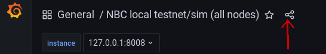
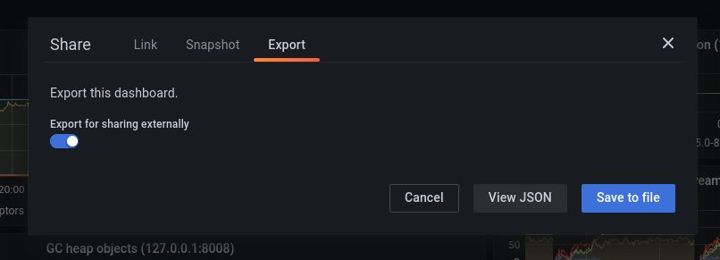

These are Grafana dashboards exported to JSON and a sample Prometheus
configuration, to get you started.

## beacon_nodes_Grafana_dashboard.json

Can be loaded in a local Grafana instance directly.

## metrics.status.im.json

Exported from [https://metrics.status.im/d/pgeNfj2Wz23/nimbus-fleet-testnets?orgId=1](https://metrics.status.im/d/pgeNfj2Wz23/nimbus-fleet-testnets?orgId=1). It diverged a little from "beacon\_nodes\_Grafana\_dashboard.json" by adding Netdata metrics and a few extra panels.

In order to use it locally, you would have to make some changes:

- remove `beacon_current_epoch{job=\"beacon-node-metrics\"},` from the "instance" variable query

- disable the "container" variable by removing `,container=\"${container}\"` from all panel queries

## exporting instructions (for developers)

Click the small "share" icon on the top-left of the Grafana dashboard:

Go to the "Export" tab and enable "Export for sharing externally":

Now you can either "Save to file" or "View JSON" and copy/paste into the destination file, whichever is faster for you.
